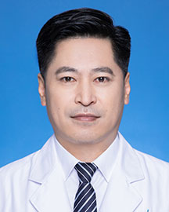

<!-- AUTO-GENERATED-BY: work/generate_obsidian_profiles.py -->

<!-- TEMPLATE: D:\workspace\信息收集整理\医生画像仓库\模板\医生画像模板.md -->

# 连继洪

## 基础信息

| 字段 | 内容 |
|---|---|
| 姓名 | 连继洪 |
| 医院 | 广东省人民医院 |
| 科室 | 血管外科 |
| 职称/身份 | 副主任医师 |
| 来源链接 | [官网原文](https://www.gdghospital.org.cn/Expertlistt/info_itemid_32864_subjectid_9.html) |
| 采集日期 | 2026-08-14 |

## 简介/擅长

对周围血管阻塞性疾病的诊治，对下肢动脉硬化闭塞、血管闭塞性脉管炎、糖尿病足病引起的溃疡、坏疽等保肢综合治疗

## 教育与进修经历

- 主要社会兼职 ： 广东省医师协会血管外科医师分会委员 广东省医学会显微外科分会青年委员及委员 广东省医学会手外科分会常务委员 国际血管联盟（IUA）中国分部专家委员会血透通路专家委员会委员 教育经历及专业特长 ： 1999年毕业于中山医科大学临床医学系，熟练掌握各种动脉瘤等常见血管疾病的外科及腔内治疗，专注擅长对周围血管阻塞性疾病的诊治，对下肢动脉硬化闭塞、血管闭塞性脉管炎、糖尿病足病引起的溃疡、坏疽等保肢综合治疗。

## 可包装亮点

- 主要社会兼职 ： 广东省医师协会血管外科医师分会委员 广东省医学会显微外科分会青年委员及委员 广东省医学会手外科分会常务委员 国际血管联盟（IUA）中国分部专家委员会血透通路专家委员会委员 教育经历及专业特长 ： 1999年毕业于中山医科大学临床医学系，熟练掌握各种动脉瘤等常见血管疾病的外科及腔内治疗，专注擅长对周围血管阻塞性疾病的诊治，对下肢动脉硬化闭塞…

## 重点疾病/人群标签

- 慢性病：糖尿病、肿瘤、瘤、复杂
- 肿瘤：糖尿病、肿瘤、瘤、复杂
- 生殖疾病：
- 免疫/风湿：
- 术后恢复/康复：
- 疑难重症：糖尿病、肿瘤、瘤、复杂

## 证据摘录

> 只摘录官网公开信息中的短句或关键字段，不复制大段原文。

- 官网身份字段：副主任医师
- 官网简介/擅长：对周围血管阻塞性疾病的诊治，对下肢动脉硬化闭塞、血管闭塞性脉管炎、糖尿病足病引起的溃疡、坏疽等保肢综合治疗
- 官网亮眼经历线索：主要社会兼职 ： 广东省医师协会血管外科医师分会委员 广东省医学会显微外科分会青年委员及委员 广东省医学会手外科分会常务委员 国际血管联盟（IUA）中国分部专家委员会血透通路专家委员会委员 教育经历及专业特长 ： 1999年毕业于中山医科大学临床医学系，熟练掌握各种动脉瘤等常见血管疾病的外科及腔内治疗，专注擅长对周围血管阻塞性疾病的诊治，对下肢动脉硬化闭塞、血管闭塞性脉管炎、糖尿病足病引起的溃疡、坏疽等保肢综合治疗。
- 来源链接：https://www.gdghospital.org.cn/Expertlistt/info_itemid_32864_subjectid_9.html

## BD 画像摘要

连继洪医生可作为慢性病、肿瘤、疑难重症方向的基础画像候选。后续 BD 使用应继续以官网来源和人工复核为准，不添加疗效承诺或无来源包装。

## 合规边界

- 仅使用医院官网、官方公众号、官方小程序等公开渠道。
- 不采集私人电话、私人微信、家庭住址、患者隐私或非公开排班信息。
- 不写“保证治愈”“疗效第一”“包治疑难杂症”等无法由官网证明的表述。
