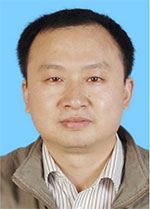

<!-- AUTO-GENERATED-BY: work/generate_obsidian_profiles.py -->

<!-- TEMPLATE: D:\workspace\信息收集整理\医生画像仓库\模板\医生画像模板.md -->

# 邓医宇

## 基础信息

| 字段 | 内容 |
|---|---|
| 姓名 | 邓医宇 |
| 医院 | 广东省人民医院 |
| 科室 | 重症医学科 |
| 职称/身份 | 主任医师 |
| 来源链接 | [官网原文](https://www.gdghospital.org.cn/Expertlistt/info_itemid_25447_subjectid_100.html) |
| 采集日期 | 2026-08-14 |

## 简介/擅长

## 教育与进修经历

- 2009年在新加坡国立大学医学院获得医学博士学位，随后在美国哈佛大学医学院附属波士顿儿童医院从事博士后研究工作。

## 科研项目与成果

- 科研成果 ：主要研究领域：1. 脓毒症脑病的发病机制、临床诊断及治疗；
- 获得国家自然科学基金面上项目资助两项，省自然科学基金一项。

## 论文与学术产出

- 近年来，在国内外杂志上共发表学术论文五十余篇，其中22篇SCI论文，第一作者或通讯作者13篇，影响因子共计60余分。

## 可包装亮点

- 博士研究生导师， 医学博士,主任医师，南方医科大学博士研究生导师、华南理工大学医学院、汕头大学医学院硕士研究生导师。
- 2009年在新加坡国立大学医学院获得医学博士学位，随后在美国哈佛大学医学院附属波士顿儿童医院从事博士后研究工作。
- 2011年7月被人才引进回国工作，现任急危重症医学部重症医学一科行政副主任。
- 专业特长 ：从事ICU工作十多年，能够熟练解决重症医学领域复杂疑难的重大技术问题，多次主持完成疑难危重病人的会诊和抢救工作。

## 重点疾病/人群标签

- 慢性病：
- 肿瘤：
- 生殖疾病：
- 免疫/风湿：
- 术后恢复/康复：营养、疑难、危重、重症、急危重、复杂
- 疑难重症：营养、疑难、危重、重症、急危重、复杂

## 证据摘录

> 只摘录官网公开信息中的短句或关键字段，不复制大段原文。

- 官网身份字段：主任医师
- 官网亮眼经历线索：博士研究生导师， 医学博士,主任医师，南方医科大学博士研究生导师、华南理工大学医学院、汕头大学医学院硕士研究生导师。 2009年在新加坡国立大学医学院获得医学博士学位，随后在美国哈佛大学医学院附属波士顿儿童医院从事博士后研究工作。 2011年7月被人才引进回国工作，现任急危重症医学部重症医学一科行政副主任。 专业特长 ：从事ICU工作十多年，能够熟练解决重症医学领域复杂疑难的重大技术问题，多次主持完成疑难危重病人的会诊和抢救工作。
- 来源链接：https://www.gdghospital.org.cn/Expertlistt/info_itemid_25447_subjectid_100.html

## BD 画像摘要

邓医宇医生可作为术后恢复/康复、疑难重症方向的基础画像候选。后续 BD 使用应继续以官网来源和人工复核为准，不添加疗效承诺或无来源包装。

## 合规边界

- 仅使用医院官网、官方公众号、官方小程序等公开渠道。
- 不采集私人电话、私人微信、家庭住址、患者隐私或非公开排班信息。
- 不写“保证治愈”“疗效第一”“包治疑难杂症”等无法由官网证明的表述。
