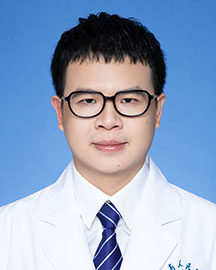

<!-- AUTO-GENERATED-BY: work/generate_obsidian_profiles.py -->

<!-- TEMPLATE: D:\workspace\信息收集整理\医生画像仓库\模板\医生画像模板.md -->

# 邓展涛

## 基础信息

| 字段 | 内容 |
|---|---|
| 姓名 | 邓展涛 |
| 医院 | 广东省人民医院 |
| 科室 | 关节骨病与创伤科 |
| 职称/身份 | 主治医师 |
| 来源链接 | [官网原文](https://www.gdghospital.org.cn/Expertlistt/info_itemid_24834_subjectid_49.html) |
| 采集日期 | 2026-08-14 |

## 简介/擅长

## 教育与进修经历

- 中国医学装备协会组织再生分会委员 教育经历和专业特长 南京大学医学院骨科学博士，西澳大学医学院访问学者，长期从事骨与关节疾病的诊治与研究，对骨与关节疾病，尤其是四肢及关节损伤、髋膝关节退行性疾病、急性及慢性运动损伤、先天性及后天型关节畸形、股骨头坏死、人工关节置换术后各种并发症等疾病有较深入的研究与理解。

## 可包装亮点

- 骨科学博士 主要社会兼职 中国老年学和老年医学学会老年骨科分会委员；
- 广东省医师协会运医学医师分会委员；
- 中国医学装备协会组织再生分会委员 教育经历和专业特长 南京大学医学院骨科学博士，西澳大学医学院访问学者，长期从事骨与关节疾病的诊治与研究，对骨与关节疾病，尤其是四肢及关节损伤、髋膝关节退行性疾病、急性及慢性运动损伤、先天性及后天型关节畸形、股骨头坏死、人工关节置换术后各种并发症等疾病有较深入的研究与理解。
- 学术专业领域成就 广东省人民医院“优秀青年人才”称号获得者。

## 重点疾病/人群标签

- 慢性病：慢性、术后
- 肿瘤：
- 生殖疾病：
- 免疫/风湿：
- 术后恢复/康复：慢性、术后
- 疑难重症：

## 证据摘录

> 只摘录官网公开信息中的短句或关键字段，不复制大段原文。

- 官网身份字段：主治医师
- 官网亮眼经历线索：骨科学博士 主要社会兼职 中国老年学和老年医学学会老年骨科分会委员； 广东省医师协会运医学医师分会委员； 中国医学装备协会组织再生分会委员 教育经历和专业特长 南京大学医学院骨科学博士，西澳大学医学院访问学者，长期从事骨与关节疾病的诊治与研究，对骨与关节疾病，尤其是四肢及关节损伤、髋膝关节退行性疾病、急性及慢性运动损伤、先天性及后天型关节畸形、股骨头坏死、人工关节置换术后各种并发症等疾病有较深入的研究与理解。 学术专业领域成就 广东省…
- 来源链接：https://www.gdghospital.org.cn/Expertlistt/info_itemid_24834_subjectid_49.html

## BD 画像摘要

邓展涛医生可作为慢性病、术后恢复/康复方向的基础画像候选。后续 BD 使用应继续以官网来源和人工复核为准，不添加疗效承诺或无来源包装。

## 合规边界

- 仅使用医院官网、官方公众号、官方小程序等公开渠道。
- 不采集私人电话、私人微信、家庭住址、患者隐私或非公开排班信息。
- 不写“保证治愈”“疗效第一”“包治疑难杂症”等无法由官网证明的表述。
