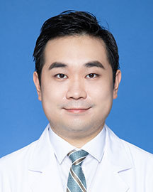

<!-- AUTO-GENERATED-BY: work/generate_obsidian_profiles.py -->

<!-- TEMPLATE: D:\workspace\信息收集整理\医生画像仓库\模板\医生画像模板.md -->

# 邓澄

## 基础信息

| 字段 | 内容 |
|---|---|
| 姓名 | 邓澄 |
| 医院 | 广东省人民医院 |
| 科室 | 胸外科 |
| 职称/身份 | 主治医师 |
| 来源链接 | [官网原文](https://www.gdghospital.org.cn/Expertlistt/info_itemid_32831_subjectid_8.html) |
| 采集日期 | 2026-08-14 |

## 简介/擅长

肺癌、食管癌等胸部恶性肿瘤的综合治疗， • 擅长漏斗胸，鸡胸等胸壁畸形的内外科微创矫治 • 从事肺移植手术和肺移植患者的全程管理 • 致力于开展胸外科围手术期症状控制与生活质量改进的患者报告结局（PRO）研究 • 设计、参与多项基础、临床研究，发表SCI论文多篇

## 论文与学术产出

- • 擅长肺癌、食管癌等胸部恶性肿瘤的综合治疗， • 擅长漏斗胸，鸡胸等胸壁畸形的内外科微创矫治 • 从事肺移植手术和肺移植患者的全程管理 • 致力于开展胸外科围手术期症状控制与生活质量改进的患者报告结局（PRO）研究 • 设计、参与多项基础、临床研究，发表SCI论文多篇。

## 可包装亮点

- 中共党员，医学硕士 胸外科/器官移植科 主治医师 社会兼职和任职 ： 广东省医师协会胸外科分会胸壁疾病专业组成员、秘书 教育经历及和专业特长 ： • 从事胸外科工作多年，掌握胸外科常见疾病的诊治。
- • 擅长肺癌、食管癌等胸部恶性肿瘤的综合治疗， • 擅长漏斗胸，鸡胸等胸壁畸形的内外科微创矫治 • 从事肺移植手术和肺移植患者的全程管理 • 致力于开展胸外科围手术期症状控制与生活质量改进的患者报告结局（PRO）研究 • 设计、参与多项基础、临床研究，发表SCI论文多篇。

## 重点疾病/人群标签

- 慢性病：
- 肿瘤：肿瘤、癌、肺癌
- 生殖疾病：
- 免疫/风湿：
- 术后恢复/康复：
- 疑难重症：

## 证据摘录

> 只摘录官网公开信息中的短句或关键字段，不复制大段原文。

- 官网身份字段：主治医师
- 官网简介/擅长：肺癌、食管癌等胸部恶性肿瘤的综合治疗， • 擅长漏斗胸，鸡胸等胸壁畸形的内外科微创矫治 • 从事肺移植手术和肺移植患者的全程管理 • 致力于开展胸外科围手术期症状控制与生活质量改进的患者报告结局（PRO）研究 • 设计、参与多项基础、临床研究，发表SCI论文多篇
- 官网亮眼经历线索：中共党员，医学硕士 胸外科/器官移植科 主治医师 社会兼职和任职 ： 广东省医师协会胸外科分会胸壁疾病专业组成员、秘书 教育经历及和专业特长 ： • 从事胸外科工作多年，掌握胸外科常见疾病的诊治。 • 擅长肺癌、食管癌等胸部恶性肿瘤的综合治疗， • 擅长漏斗胸，鸡胸等胸壁畸形的内外科微创矫治 • 从事肺移植手术和肺移植患者的全程管理 • 致力于开展胸外科围手术期症状控制与生活质量改进的患者报告结局（PRO）研究 • 设计、参与多项基础…
- 来源链接：https://www.gdghospital.org.cn/Expertlistt/info_itemid_32831_subjectid_8.html

## BD 画像摘要

邓澄医生可作为肿瘤方向的基础画像候选。后续 BD 使用应继续以官网来源和人工复核为准，不添加疗效承诺或无来源包装。

## 合规边界

- 仅使用医院官网、官方公众号、官方小程序等公开渠道。
- 不采集私人电话、私人微信、家庭住址、患者隐私或非公开排班信息。
- 不写“保证治愈”“疗效第一”“包治疑难杂症”等无法由官网证明的表述。
