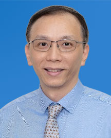

<!-- AUTO-GENERATED-BY: work/generate_obsidian_profiles.py -->

<!-- TEMPLATE: D:\workspace\信息收集整理\医生画像仓库\模板\医生画像模板.md -->

# 邝建

## 基础信息

| 字段 | 内容 |
|---|---|
| 姓名 | 邝建 |
| 医院 | 广东省人民医院 |
| 科室 | 内分泌科 |
| 职称/身份 | 主任医师 科主任 |
| 来源链接 | [官网原文](https://www.gdghospital.org.cn/Expertlistt/info_itemid_23261_subjectid_20.html) |
| 采集日期 | 2026-08-14 |

## 简介/擅长

在代谢内分泌疾病诊疗积累了丰富临床经验，擅长治疗糖尿病、甲状腺、肾上腺、垂体等常见及相关疑难罕见疾病临床诊治

## 科研项目与成果

- 代表成果 ：主要研究方向糖尿病血糖监测与慢性并发症；
- 主持完成2018年国家重点研发计划项目课题”2 型糖尿病智能化健康管理体系的建立”；
- 2021年广州市重点研发计划项目”甲状腺良性结节高强度聚焦超声(EP-HIFU)功率调控无痛消融技术随机对照先导研究；
- 2022年广州市临床特色技术项目《甲状腺病损射频消融术》；

## 论文与学术产出

- 参编国内糖尿病、甲状腺相关指南/共识近10项；

## 可包装亮点

- 专长 ：在代谢内分泌疾病诊疗积累了丰富临床经验，擅长治疗糖尿病、甲状腺、肾上腺、垂体等常见及相关疑难罕见疾病临床诊治。
- 履历 ：现任广东省人民医院内分泌科主任，主任医师，医学博士，博士研究生导师。
- 中国医师协会内分泌代谢科医师分会常委；
- 中华医学会糖尿病学分会委员；

## 重点疾病/人群标签

- 慢性病：糖尿病、慢性、代谢、肿瘤、疑难、罕见
- 肿瘤：糖尿病、慢性、代谢、肿瘤、疑难、罕见
- 生殖疾病：
- 免疫/风湿：
- 术后恢复/康复：
- 疑难重症：糖尿病、慢性、代谢、肿瘤、疑难、罕见

## 证据摘录

> 只摘录官网公开信息中的短句或关键字段，不复制大段原文。

- 官网身份字段：主任医师 科主任
- 官网简介/擅长：在代谢内分泌疾病诊疗积累了丰富临床经验，擅长治疗糖尿病、甲状腺、肾上腺、垂体等常见及相关疑难罕见疾病临床诊治
- 官网亮眼经历线索：专长 ：在代谢内分泌疾病诊疗积累了丰富临床经验，擅长治疗糖尿病、甲状腺、肾上腺、垂体等常见及相关疑难罕见疾病临床诊治。 履历 ：现任广东省人民医院内分泌科主任，主任医师，医学博士，博士研究生导师。 中国医师协会内分泌代谢科医师分会常委； 中华医学会糖尿病学分会委员；
- 来源链接：https://www.gdghospital.org.cn/Expertlistt/info_itemid_23261_subjectid_20.html

## BD 画像摘要

邝建医生可作为慢性病、肿瘤、疑难重症方向的基础画像候选。后续 BD 使用应继续以官网来源和人工复核为准，不添加疗效承诺或无来源包装。

## 合规边界

- 仅使用医院官网、官方公众号、官方小程序等公开渠道。
- 不采集私人电话、私人微信、家庭住址、患者隐私或非公开排班信息。
- 不写“保证治愈”“疗效第一”“包治疑难杂症”等无法由官网证明的表述。
