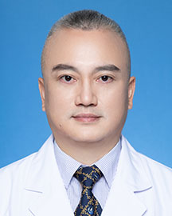

<!-- AUTO-GENERATED-BY: work/generate_obsidian_profiles.py -->

<!-- TEMPLATE: D:\workspace\信息收集整理\医生画像仓库\模板\医生画像模板.md -->

# 邝石峰

## 基础信息

| 字段 | 内容 |
|---|---|
| 姓名 | 邝石峰 |
| 医院 | 广东省人民医院 |
| 科室 | 整形外科 |
| 职称/身份 | 副主任医师 |
| 来源链接 | [官网原文](https://www.gdghospital.org.cn/Expertlistt/info_itemid_32862_subjectid_117.html) |
| 采集日期 | 2026-08-14 |

## 简介/擅长

1.乳房整形（自体脂肪注射隆乳，假体隆乳，乳房下垂矫正，巨乳缩小，乳头乳晕整形，乳头内陷矫正、乳头再造，奥美定取出修复）

## 可包装亮点

- 中共党员，支部书记，医学硕士 主要社会兼职 广东省整形美容协会整形美容外科分会副主任委员 广东省整形美容协会常务理事及医疗美容质量管理分会常委 广东省修复重建外科学会副主任委员 中国整形美容协会抗衰老分会理事 广东省医学会显微外科学分会常委 广东省医师协会整形及美容外科医师分会常委 广东省医学会整形外科分会委员 广东省医学会血管外科学分会委员 教育经历和专…
- 学术专业领域成就 第六届羊城好医生及第二届平安中国好医生称号。

## 重点疾病/人群标签

- 慢性病：慢性、肿瘤、瘤
- 肿瘤：慢性、肿瘤、瘤
- 生殖疾病：
- 免疫/风湿：
- 术后恢复/康复：
- 疑难重症：

## 证据摘录

> 只摘录官网公开信息中的短句或关键字段，不复制大段原文。

- 官网身份字段：副主任医师
- 官网简介/擅长：1.乳房整形（自体脂肪注射隆乳，假体隆乳，乳房下垂矫正，巨乳缩小，乳头乳晕整形，乳头内陷矫正、乳头再造，奥美定取出修复）
- 官网亮眼经历线索：中共党员，支部书记，医学硕士 主要社会兼职 广东省整形美容协会整形美容外科分会副主任委员 广东省整形美容协会常务理事及医疗美容质量管理分会常委 广东省修复重建外科学会副主任委员 中国整形美容协会抗衰老分会理事 广东省医学会显微外科学分会常委 广东省医师协会整形及美容外科医师分会常委 广东省医学会整形外科分会委员 广东省医学会血管外科学分会委员 教育经历和专业特长 擅长：1.乳房整形（自体脂肪注射隆乳，假体隆乳，乳房下垂矫正，巨乳缩小…
- 来源链接：https://www.gdghospital.org.cn/Expertlistt/info_itemid_32862_subjectid_117.html

## BD 画像摘要

邝石峰医生可作为慢性病、肿瘤方向的基础画像候选。后续 BD 使用应继续以官网来源和人工复核为准，不添加疗效承诺或无来源包装。

## 合规边界

- 仅使用医院官网、官方公众号、官方小程序等公开渠道。
- 不采集私人电话、私人微信、家庭住址、患者隐私或非公开排班信息。
- 不写“保证治愈”“疗效第一”“包治疑难杂症”等无法由官网证明的表述。
