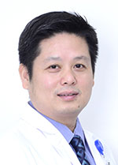

<!-- AUTO-GENERATED-BY: work/generate_obsidian_profiles.py -->

<!-- TEMPLATE: D:\workspace\信息收集整理\医生画像仓库\模板\医生画像模板.md -->

# 邱前辉

## 基础信息

| 字段 | 内容 |
|---|---|
| 姓名 | 邱前辉 |
| 医院 | 广东省人民医院 |
| 科室 | 鼻科 |
| 职称/身份 | 主任医师 |
| 来源链接 | [官网原文](https://www.gdghospital.org.cn/Expertlistt/info_itemid_24954_subjectid_110.html) |
| 采集日期 | 2026-08-14 |

## 简介/擅长

鼻内镜下鼻腔鼻窦以及颅底良恶性肿瘤的微创手术治疗如无需动脉介入栓塞的新式内镜下鼻咽纤维血管瘤手术，内镜下鼻腔鼻窦肿瘤或颅内外沟通瘤的微创切除和颅底重建术，内镜下颅底斜坡区肿瘤如脊索瘤、脑膜瘤手术

## 教育与进修经历

- 医学博士，耳鼻喉科行政副主任 南方医科大学耳鼻咽喉科学博士及博士后导师 汕头大学耳鼻咽喉科学硕士生导师 华南理工大学生物医学工程学硕士生导师 广东省医学会变态反应分会主任委员 中国医疗保健国际交流促进会过敏科学分会 副主任委员 中华医学会变态反应分会全国委员 中国中西医结合耳鼻咽喉科专业委员会变态反应专家委员会副主任委员 中国中西医结合耳鼻咽喉科专业委员鼻颅底肿瘤和嗅觉专家委员会副主任委员 广东省医师协会变态反应工作委员会学术顾问 广东省医师协会耳鼻咽喉科分会鼻科专业组副组长 广东省医师协会耳鼻喉科分会常委 广东…

## 科研项目与成果

- 主持国家和省部级课题15项，其中国自然1项，广州市重大科技项目1项。

## 论文与学术产出

- 至2021年以第1作者或通讯作者发表论文90余篇。

## 可包装亮点

- 医学博士，耳鼻喉科行政副主任 南方医科大学耳鼻咽喉科学博士及博士后导师 汕头大学耳鼻咽喉科学硕士生导师 华南理工大学生物医学工程学硕士生导师 广东省医学会变态反应分会主任委员 中国医疗保健国际交流促进会过敏科学分会 副主任委员 中华医学会变态反应分会全国委员 中国中西医结合耳鼻咽喉科专业委员会变态反应专家委员会副主任委员 中国中西医结合耳鼻咽喉科专业委员鼻…

## 重点疾病/人群标签

- 慢性病：
- 肿瘤：肿瘤、癌、瘤、放疗、鼻咽癌、免疫、恢复
- 生殖疾病：
- 免疫/风湿：肿瘤、癌、瘤、放疗、鼻咽癌、免疫、恢复
- 术后恢复/康复：肿瘤、癌、瘤、放疗、鼻咽癌、免疫、恢复
- 疑难重症：

## 证据摘录

> 只摘录官网公开信息中的短句或关键字段，不复制大段原文。

- 官网身份字段：主任医师
- 官网简介/擅长：鼻内镜下鼻腔鼻窦以及颅底良恶性肿瘤的微创手术治疗如无需动脉介入栓塞的新式内镜下鼻咽纤维血管瘤手术，内镜下鼻腔鼻窦肿瘤或颅内外沟通瘤的微创切除和颅底重建术，内镜下颅底斜坡区肿瘤如脊索瘤、脑膜瘤手术
- 官网亮眼经历线索：医学博士，耳鼻喉科行政副主任 南方医科大学耳鼻咽喉科学博士及博士后导师 汕头大学耳鼻咽喉科学硕士生导师 华南理工大学生物医学工程学硕士生导师 广东省医学会变态反应分会主任委员 中国医疗保健国际交流促进会过敏科学分会 副主任委员 中华医学会变态反应分会全国委员 中国中西医结合耳鼻咽喉科专业委员会变态反应专家委员会副主任委员 中国中西医结合耳鼻咽喉科专业委员鼻颅底肿瘤和嗅觉专家委员会副主任委员 广东省医师协会变态反应工作委员会学术顾问 广…
- 来源链接：https://www.gdghospital.org.cn/Expertlistt/info_itemid_24954_subjectid_110.html

## BD 画像摘要

邱前辉医生可作为肿瘤、免疫/风湿/感染、术后恢复/康复方向的基础画像候选。后续 BD 使用应继续以官网来源和人工复核为准，不添加疗效承诺或无来源包装。

## 合规边界

- 仅使用医院官网、官方公众号、官方小程序等公开渠道。
- 不采集私人电话、私人微信、家庭住址、患者隐私或非公开排班信息。
- 不写“保证治愈”“疗效第一”“包治疑难杂症”等无法由官网证明的表述。
