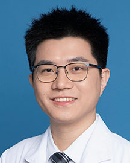

<!-- AUTO-GENERATED-BY: work/generate_obsidian_profiles.py -->

<!-- TEMPLATE: D:\workspace\信息收集整理\医生画像仓库\模板\医生画像模板.md -->

# 邱镇斌

## 基础信息

| 字段 | 内容 |
|---|---|
| 姓名 | 邱镇斌 |
| 医院 | 广东省人民医院 |
| 科室 | 肺外科 |
| 职称/身份 | 住院医师 |
| 来源链接 | [官网原文](https://www.gdghospital.org.cn/Expertlistt/info_itemid_67161_subjectid_25.html) |
| 采集日期 | 2026-08-14 |

## 简介/擅长

擅长以外科为主的肺部肿瘤单病种多学科综合治疗，包括肺小结节的早期筛查诊断 及微创手术治疗

## 教育与进修经历

- 简介 医学博士，在广东省肺癌研究所完成硕博培训，师从著名肺部肿瘤专家钟文昭教 授，主攻以外科为主的肺部肿瘤综合治疗。

## 论文与学术产出

- 以第一/共同第一作者在JTCVS，JTO，Europ Radiol和ASO等SCI期刊发表学术论 文10余篇；

## 可包装亮点

- 专长 擅长以外科为主的肺部肿瘤单病种多学科综合治疗，包括肺小结节的早期筛查诊断 及微创手术治疗；
- 以第一/共同第一作者在JTCVS，JTO，Europ Radiol和ASO等SCI期刊发表学术论 文10余篇；
- 曾于美国斯坦福大学医学中心胸心外科访问交流。
- 荣誉奖励 曾获ESMO-Asia Travel Award，IASLC Developing Nation Educational Award和 IASLC International Mentorship Award等。

## 重点疾病/人群标签

- 慢性病：
- 肿瘤：肿瘤、肺癌、多学科
- 生殖疾病：
- 免疫/风湿：
- 术后恢复/康复：
- 疑难重症：肿瘤、肺癌、多学科

## 证据摘录

> 只摘录官网公开信息中的短句或关键字段，不复制大段原文。

- 官网身份字段：住院医师
- 官网简介/擅长：擅长以外科为主的肺部肿瘤单病种多学科综合治疗，包括肺小结节的早期筛查诊断 及微创手术治疗
- 官网亮眼经历线索：专长 擅长以外科为主的肺部肿瘤单病种多学科综合治疗，包括肺小结节的早期筛查诊断 及微创手术治疗； 以第一/共同第一作者在JTCVS，JTO，Europ Radiol和ASO等SCI期刊发表学术论 文10余篇； 曾于美国斯坦福大学医学中心胸心外科访问交流。 荣誉奖励 曾获ESMO-Asia Travel Award，IASLC Developing Nation Educational Award和 IASLC Internationa…
- 来源链接：https://www.gdghospital.org.cn/Expertlistt/info_itemid_67161_subjectid_25.html

## BD 画像摘要

邱镇斌医生可作为肿瘤、疑难重症方向的基础画像候选。后续 BD 使用应继续以官网来源和人工复核为准，不添加疗效承诺或无来源包装。

## 合规边界

- 仅使用医院官网、官方公众号、官方小程序等公开渠道。
- 不采集私人电话、私人微信、家庭住址、患者隐私或非公开排班信息。
- 不写“保证治愈”“疗效第一”“包治疑难杂症”等无法由官网证明的表述。
