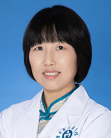

<!-- AUTO-GENERATED-BY: work/generate_obsidian_profiles.py -->

<!-- TEMPLATE: D:\workspace\信息收集整理\医生画像仓库\模板\医生画像模板.md -->

# 邸玉玮

## 基础信息

| 字段 | 内容 |
|---|---|
| 姓名 | 邸玉玮 |
| 医院 | 广东省人民医院 |
| 科室 | 检验科 |
| 职称/身份 | 主任技师 |
| 来源链接 | [官网原文](https://www.gdghospital.org.cn/Expertlistt/info_itemid_25321_subjectid_60.html) |
| 采集日期 | 2026-08-14 |

## 简介/擅长

## 科研项目与成果

- 负责国家、广东省、广州市科研基金多项 ，发表SCI、中文核心论著二十余篇，发明专利授权1项。
- 主持广东省质量工程、南方医科大学、华南理工大学教学改革项目，并在《中华检验医学杂志》等发表教研论文多篇。

## 论文与学术产出

- 负责国家、广东省、广州市科研基金多项 ，发表SCI、中文核心论著二十余篇，发明专利授权1项。
- 主持广东省质量工程、南方医科大学、华南理工大学教学改革项目，并在《中华检验医学杂志》等发表教研论文多篇。

## 可包装亮点

- 检验医学基地教学主任、主任技师、硕士生导师、协和医科大学生物化学与分子生物学专业博士 专业方向为临床检验诊断、临床分子诊断。
- 负责国家、广东省、广州市科研基金多项 ，发表SCI、中文核心论著二十余篇，发明专利授权1项。
- 主持广东省质量工程、南方医科大学、华南理工大学教学改革项目，并在《中华检验医学杂志》等发表教研论文多篇。
- 广东省临床医学学会肿瘤心脏病学专业委员会委员，中国人体健康科技促进会-临床微生物与感染精准检验专委会委员。

## 重点疾病/人群标签

- 慢性病：
- 肿瘤：
- 生殖疾病：
- 免疫/风湿：
- 术后恢复/康复：
- 疑难重症：

## 证据摘录

> 只摘录官网公开信息中的短句或关键字段，不复制大段原文。

- 官网身份字段：主任技师
- 官网亮眼经历线索：检验医学基地教学主任、主任技师、硕士生导师、协和医科大学生物化学与分子生物学专业博士 专业方向为临床检验诊断、临床分子诊断。 负责国家、广东省、广州市科研基金多项 ，发表SCI、中文核心论著二十余篇，发明专利授权1项。 主持广东省质量工程、南方医科大学、华南理工大学教学改革项目，并在《中华检验医学杂志》等发表教研论文多篇。 广东省临床医学学会肿瘤心脏病学专业委员会委员，中国人体健康科技促进会-临床微生物与感染精准检验专委会委员。
- 异常提示：职称/身份需人工复核
- 来源链接：https://www.gdghospital.org.cn/Expertlistt/info_itemid_25321_subjectid_60.html

## BD 画像摘要

邸玉玮医生可作为广东省人民医院检验科的基础医生资料入库。当前重点方向以总底表标签为准，官网未展示的信息保持空白。

## 合规边界

- 仅使用医院官网、官方公众号、官方小程序等公开渠道。
- 不采集私人电话、私人微信、家庭住址、患者隐私或非公开排班信息。
- 不写“保证治愈”“疗效第一”“包治疑难杂症”等无法由官网证明的表述。
