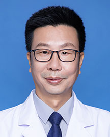

<!-- AUTO-GENERATED-BY: work/generate_obsidian_profiles.py -->

<!-- TEMPLATE: D:\workspace\信息收集整理\医生画像仓库\模板\医生画像模板.md -->

# 郑少逸

## 基础信息

| 字段 | 内容 |
|---|---|
| 姓名 | 郑少逸 |
| 医院 | 广东省人民医院 |
| 科室 | 烧伤与创面修复外科 |
| 职称/身份 | 副主任医师 |
| 来源链接 | [官网原文](https://www.gdghospital.org.cn/Expertlistt/info_itemid_24800_subjectid_10.html) |
| 采集日期 | 2026-08-14 |

## 简介/擅长

1、非哺乳期乳腺炎及乳腺脓肿的治疗 2、开胸术后难愈合伤口的治疗 3、烧伤后期瘢痕整复、功能重建 4、糖尿病足的保肢治疗 5、色素紊乱的手术治疗 6、机器热压伤的手术治疗 7、体表肿瘤的治疗 学术专业领域成就： 2019年获广东省科技进步二等奖

## 可包装亮点

- 中共党员，正高资格 社会兼职： 1、广东省医学会烧伤外科学分会 常委 2、中国医师协会广东省烧伤医师分会 委员 3、中华医学会烧伤外科学分会第八届委员会烧伤临床学组 委员 4、中国康复医学会广东省分会修复重建外科专业 委员 5、广东省医学会医疗事故技术鉴定专家库成员 6、广东省工伤鉴定委员会成员 7、广东省第三类技术专家库成员 医疗专长： 1、非哺乳期乳腺…

## 重点疾病/人群标签

- 慢性病：糖尿病、肿瘤、术后、康复、创面、烧伤、伤口
- 肿瘤：糖尿病、肿瘤、术后、康复、创面、烧伤、伤口
- 生殖疾病：
- 免疫/风湿：
- 术后恢复/康复：糖尿病、肿瘤、术后、康复、创面、烧伤、伤口
- 疑难重症：

## 证据摘录

> 只摘录官网公开信息中的短句或关键字段，不复制大段原文。

- 官网身份字段：副主任医师
- 官网简介/擅长：1、非哺乳期乳腺炎及乳腺脓肿的治疗 2、开胸术后难愈合伤口的治疗 3、烧伤后期瘢痕整复、功能重建 4、糖尿病足的保肢治疗 5、色素紊乱的手术治疗 6、机器热压伤的手术治疗 7、体表肿瘤的治疗 学术专业领域成就： 2019年获广东省科技进步二等奖
- 官网亮眼经历线索：中共党员，正高资格 社会兼职： 1、广东省医学会烧伤外科学分会 常委 2、中国医师协会广东省烧伤医师分会 委员 3、中华医学会烧伤外科学分会第八届委员会烧伤临床学组 委员 4、中国康复医学会广东省分会修复重建外科专业 委员 5、广东省医学会医疗事故技术鉴定专家库成员 6、广东省工伤鉴定委员会成员 7、广东省第三类技术专家库成员 医疗专长： 1、非哺乳期乳腺炎及乳腺脓肿的治疗 2、开胸术后难愈合伤口的治疗 3、烧伤后期瘢痕整复、功能重建…
- 来源链接：https://www.gdghospital.org.cn/Expertlistt/info_itemid_24800_subjectid_10.html

## BD 画像摘要

郑少逸医生可作为慢性病、肿瘤、术后恢复/康复方向的基础画像候选。后续 BD 使用应继续以官网来源和人工复核为准，不添加疗效承诺或无来源包装。

## 合规边界

- 仅使用医院官网、官方公众号、官方小程序等公开渠道。
- 不采集私人电话、私人微信、家庭住址、患者隐私或非公开排班信息。
- 不写“保证治愈”“疗效第一”“包治疑难杂症”等无法由官网证明的表述。
