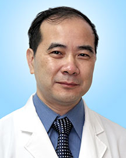

<!-- AUTO-GENERATED-BY: work/generate_obsidian_profiles.py -->

<!-- TEMPLATE: D:\workspace\信息收集整理\医生画像仓库\模板\医生画像模板.md -->

# 郑秋坚

## 基础信息

| 字段 | 内容 |
|---|---|
| 姓名 | 郑秋坚 |
| 医院 | 广东省人民医院 |
| 科室 | 关节骨病与创伤科 |
| 职称/身份 | 主任医师 |
| 来源链接 | [官网原文](https://www.gdghospital.org.cn/Expertlistt/info_itemid_24830_subjectid_49.html) |
| 采集日期 | 2026-08-14 |

## 简介/擅长

成年先天性髋关节脱位的髋关节置换、髋关节假体周围骨折的处理、微创髋关节置换手术、严重畸形膝关节置换、人工关节术后感染处理等，尤其对股骨头坏死、关节软骨损伤的修复等复杂问题有深入研究及见解

## 教育与进修经历

- 骨科行政主任兼关节骨病与创伤科行政主任，博士生导师 主要社会兼职 第十一届中华医学会骨科学分会委员、中华医学会骨科学分会关节外科学组委员 第五届中国医师协会骨科医师分会委员会委员、膝关节学组副组长 第二届中国残疾人康复协会肢体残疾康复专业委员会关节残障康复学组副主任委员 第三届广东省医学会关节外科学分会副主任委员 第一届粤港澳大湾区骨关节外科医师联盟主任 教育经历和专业特长 毕业于广州中山医科大学，从医33年，是国内最早开展关节置换、关节镜微创治疗关节疾病的专家之一。
- 曾前往新加坡总医院、德国Bad Kreuznach医院等国际著名骨科医院进修学习，并多次出国与国际同行在骨科学术研讨会上进行学术交流。

## 可包装亮点

- 骨科行政主任兼关节骨病与创伤科行政主任，博士生导师 主要社会兼职 第十一届中华医学会骨科学分会委员、中华医学会骨科学分会关节外科学组委员 第五届中国医师协会骨科医师分会委员会委员、膝关节学组副组长 第二届中国残疾人康复协会肢体残疾康复专业委员会关节残障康复学组副主任委员 第三届广东省医学会关节外科学分会副主任委员 第一届粤港澳大湾区骨关节外科医师联盟主任…
- 曾前往新加坡总医院、德国Bad Kreuznach医院等国际著名骨科医院进修学习，并多次出国与国际同行在骨科学术研讨会上进行学术交流。

## 重点疾病/人群标签

- 慢性病：
- 肿瘤：
- 生殖疾病：
- 免疫/风湿：感染、术后、康复、复杂
- 术后恢复/康复：感染、术后、康复、复杂
- 疑难重症：感染、术后、康复、复杂

## 证据摘录

> 只摘录官网公开信息中的短句或关键字段，不复制大段原文。

- 官网身份字段：主任医师
- 官网简介/擅长：成年先天性髋关节脱位的髋关节置换、髋关节假体周围骨折的处理、微创髋关节置换手术、严重畸形膝关节置换、人工关节术后感染处理等，尤其对股骨头坏死、关节软骨损伤的修复等复杂问题有深入研究及见解
- 官网亮眼经历线索：骨科行政主任兼关节骨病与创伤科行政主任，博士生导师 主要社会兼职 第十一届中华医学会骨科学分会委员、中华医学会骨科学分会关节外科学组委员 第五届中国医师协会骨科医师分会委员会委员、膝关节学组副组长 第二届中国残疾人康复协会肢体残疾康复专业委员会关节残障康复学组副主任委员 第三届广东省医学会关节外科学分会副主任委员 第一届粤港澳大湾区骨关节外科医师联盟主任 教育经历和专业特长 毕业于广州中山医科大学，从医33年，是国内最早开展关节置换…
- 来源链接：https://www.gdghospital.org.cn/Expertlistt/info_itemid_24830_subjectid_49.html

## BD 画像摘要

郑秋坚医生可作为免疫/风湿/感染、术后恢复/康复、疑难重症方向的基础画像候选。后续 BD 使用应继续以官网来源和人工复核为准，不添加疗效承诺或无来源包装。

## 合规边界

- 仅使用医院官网、官方公众号、官方小程序等公开渠道。
- 不采集私人电话、私人微信、家庭住址、患者隐私或非公开排班信息。
- 不写“保证治愈”“疗效第一”“包治疑难杂症”等无法由官网证明的表述。
