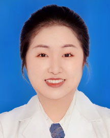

<!-- AUTO-GENERATED-BY: work/generate_obsidian_profiles.py -->

<!-- TEMPLATE: D:\workspace\信息收集整理\医生画像仓库\模板\医生画像模板.md -->

# 郑雪松

## 基础信息

| 字段 | 内容 |
|---|---|
| 姓名 | 郑雪松 |
| 医院 | 广东省人民医院 |
| 科室 | 口腔科门诊 |
| 职称/身份 | 主治医师 |
| 来源链接 | [官网原文](https://www.gdghospital.org.cn/Expertlistt/info_itemid_55466_subjectid_47.html) |
| 采集日期 | 2026-08-14 |

## 简介/擅长

熟练运用直丝弓矫治技术、无托槽隐形矫治技术、正畸正颌联合治疗、微种植钉支 抗、功能及活动矫治技术治疗成人及青少年各类错牙颌畸形，包括牙齿不齐、牙列 散在间隙、龅牙、地包天、下颌后缩、埋伏牙等

## 教育与进修经历

- 简介 硕士毕业于中国医科大学口腔医学院，擅长各类青少年和成人错颌畸形的矫治，从事口腔临床工作10年，熟练掌握口腔正畸常见错颌畸形的诊断和治疗，尤其擅长 复杂性牙齿畸形矫正、自锁托槽矫正、无托槽隐形矫正等。

## 论文与学术产出

- 曾发表SCI期刊文章， 多次参加国内外学术会议，Invisalign隐适美和Angelalign时代天使无托槽隐形矫治 认证医师，中华口腔医学会正畸专业委员会会员，第一届广东省医学美容学会口腔 医学会委员。

## 可包装亮点

- 曾发表SCI期刊文章， 多次参加国内外学术会议，Invisalign隐适美和Angelalign时代天使无托槽隐形矫治 认证医师，中华口腔医学会正畸专业委员会会员，第一届广东省医学美容学会口腔 医学会委员。

## 重点疾病/人群标签

- 慢性病：
- 肿瘤：
- 生殖疾病：
- 免疫/风湿：
- 术后恢复/康复：
- 疑难重症：复杂

## 证据摘录

> 只摘录官网公开信息中的短句或关键字段，不复制大段原文。

- 官网身份字段：主治医师
- 官网简介/擅长：熟练运用直丝弓矫治技术、无托槽隐形矫治技术、正畸正颌联合治疗、微种植钉支 抗、功能及活动矫治技术治疗成人及青少年各类错牙颌畸形，包括牙齿不齐、牙列 散在间隙、龅牙、地包天、下颌后缩、埋伏牙等
- 官网亮眼经历线索：曾发表SCI期刊文章， 多次参加国内外学术会议，Invisalign隐适美和Angelalign时代天使无托槽隐形矫治 认证医师，中华口腔医学会正畸专业委员会会员，第一届广东省医学美容学会口腔 医学会委员。
- 来源链接：https://www.gdghospital.org.cn/Expertlistt/info_itemid_55466_subjectid_47.html

## BD 画像摘要

郑雪松医生可作为疑难重症方向的基础画像候选。后续 BD 使用应继续以官网来源和人工复核为准，不添加疗效承诺或无来源包装。

## 合规边界

- 仅使用医院官网、官方公众号、官方小程序等公开渠道。
- 不采集私人电话、私人微信、家庭住址、患者隐私或非公开排班信息。
- 不写“保证治愈”“疗效第一”“包治疑难杂症”等无法由官网证明的表述。
