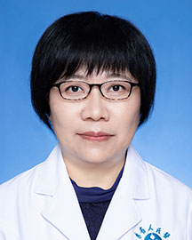

<!-- AUTO-GENERATED-BY: work/generate_obsidian_profiles.py -->

<!-- TEMPLATE: D:\workspace\信息收集整理\医生画像仓库\模板\医生画像模板.md -->

# 郭绮云

## 基础信息

| 字段 | 内容 |
|---|---|
| 姓名 | 郭绮云 |
| 医院 | 广东省人民医院 |
| 科室 | 康复医学科 |
| 职称/身份 | 副主任医师 |
| 来源链接 | [官网原文](https://www.gdghospital.org.cn/Expertlistt/info_itemid_23068_subjectid_97.html) |
| 采集日期 | 2026-08-14 |

## 简介/擅长

于面瘫、偏瘫、颈肩腰腿痛、失眠、月经不调、痛经、良性前列腺增生症、痤疮、肥胖症及多种慢性病、老年病的诊治

## 教育与进修经历

- 康复医学科针灸专业副主任中医师，毕业于广州中医药大学针灸系，曾经分别在中山医科大学和武汉同济医科大学进修物理医学和康复医学，现在中山大学医学院进修研究生课程。

## 论文与学术产出

- 在 “中国针灸”、“中华物理医学与康复杂志”、“中国临床康复”等刊物上发表医学论文多篇。

## 可包装亮点

- 康复医学科针灸专业副主任中医师，毕业于广州中医药大学针灸系，曾经分别在中山医科大学和武汉同济医科大学进修物理医学和康复医学，现在中山大学医学院进修研究生课程。
- 在 “中国针灸”、“中华物理医学与康复杂志”、“中国临床康复”等刊物上发表医学论文多篇。

## 重点疾病/人群标签

- 慢性病：慢性、月经、康复、复杂
- 肿瘤：
- 生殖疾病：慢性、月经、康复、复杂
- 免疫/风湿：
- 术后恢复/康复：慢性、月经、康复、复杂
- 疑难重症：慢性、月经、康复、复杂

## 证据摘录

> 只摘录官网公开信息中的短句或关键字段，不复制大段原文。

- 官网身份字段：副主任医师
- 官网简介/擅长：于面瘫、偏瘫、颈肩腰腿痛、失眠、月经不调、痛经、良性前列腺增生症、痤疮、肥胖症及多种慢性病、老年病的诊治
- 官网亮眼经历线索：康复医学科针灸专业副主任中医师，毕业于广州中医药大学针灸系，曾经分别在中山医科大学和武汉同济医科大学进修物理医学和康复医学，现在中山大学医学院进修研究生课程。 在 “中国针灸”、“中华物理医学与康复杂志”、“中国临床康复”等刊物上发表医学论文多篇。
- 来源链接：https://www.gdghospital.org.cn/Expertlistt/info_itemid_23068_subjectid_97.html

## BD 画像摘要

郭绮云医生可作为慢性病、生殖疾病、术后恢复/康复、疑难重症方向的基础画像候选。后续 BD 使用应继续以官网来源和人工复核为准，不添加疗效承诺或无来源包装。

## 合规边界

- 仅使用医院官网、官方公众号、官方小程序等公开渠道。
- 不采集私人电话、私人微信、家庭住址、患者隐私或非公开排班信息。
- 不写“保证治愈”“疗效第一”“包治疑难杂症”等无法由官网证明的表述。
