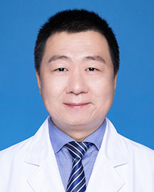

<!-- AUTO-GENERATED-BY: work/generate_obsidian_profiles.py -->

<!-- TEMPLATE: D:\workspace\信息收集整理\医生画像仓库\模板\医生画像模板.md -->

# 郭飞

## 基础信息

| 字段 | 内容 |
|---|---|
| 姓名 | 郭飞 |
| 医院 | 广东省人民医院 |
| 科室 | 泌尿外科 |
| 职称/身份 | 副主任医师 |
| 来源链接 | [官网原文](https://www.gdghospital.org.cn/Expertlistt/info_itemid_24794_subjectid_7.html) |
| 采集日期 | 2026-08-14 |

## 简介/擅长

良性前列腺增生的内镜微创手术，肾上腺肿瘤、肾肿瘤的腹腔镜微创手术

## 教育与进修经历

- 主要社会任职 ： 国家卫健委全球卫生后备人才库成员 广东省医学会男科学分会第四届委员会青年委员 广东省性学会第五届理事会理事 广东省中西医结合学会男科专委会第五届委员会常务委员 广东省泌尿生殖协会转化医学分会第三届委员会委员 广东省泌尿生殖协会尿路修复重建学分会第一届委员会委员 广东省健康养生协会泌尿健康分会第一届委员会委员 广东省健康养生协会微创尿路修复分会第一届委员会委员 教育背景及专业特长 ： 毕业于华中科技大学，意大利那不勒斯国家肿瘤中心访问学者。

## 可包装亮点

- 主要社会任职 ： 国家卫健委全球卫生后备人才库成员 广东省医学会男科学分会第四届委员会青年委员 广东省性学会第五届理事会理事 广东省中西医结合学会男科专委会第五届委员会常务委员 广东省泌尿生殖协会转化医学分会第三届委员会委员 广东省泌尿生殖协会尿路修复重建学分会第一届委员会委员 广东省健康养生协会泌尿健康分会第一届委员会委员 广东省健康养生协会微创尿路修复…

## 重点疾病/人群标签

- 慢性病：
- 肿瘤：肿瘤、生殖
- 生殖疾病：肿瘤、生殖
- 免疫/风湿：
- 术后恢复/康复：
- 疑难重症：

## 证据摘录

> 只摘录官网公开信息中的短句或关键字段，不复制大段原文。

- 官网身份字段：副主任医师
- 官网简介/擅长：良性前列腺增生的内镜微创手术，肾上腺肿瘤、肾肿瘤的腹腔镜微创手术
- 官网亮眼经历线索：主要社会任职 ： 国家卫健委全球卫生后备人才库成员 广东省医学会男科学分会第四届委员会青年委员 广东省性学会第五届理事会理事 广东省中西医结合学会男科专委会第五届委员会常务委员 广东省泌尿生殖协会转化医学分会第三届委员会委员 广东省泌尿生殖协会尿路修复重建学分会第一届委员会委员 广东省健康养生协会泌尿健康分会第一届委员会委员 广东省健康养生协会微创尿路修复分会第一届委员会委员 教育背景及专业特长 ： 毕业于华中科技大学，意大利那不勒斯…
- 来源链接：https://www.gdghospital.org.cn/Expertlistt/info_itemid_24794_subjectid_7.html

## BD 画像摘要

郭飞医生可作为肿瘤、生殖疾病方向的基础画像候选。后续 BD 使用应继续以官网来源和人工复核为准，不添加疗效承诺或无来源包装。

## 合规边界

- 仅使用医院官网、官方公众号、官方小程序等公开渠道。
- 不采集私人电话、私人微信、家庭住址、患者隐私或非公开排班信息。
- 不写“保证治愈”“疗效第一”“包治疑难杂症”等无法由官网证明的表述。
