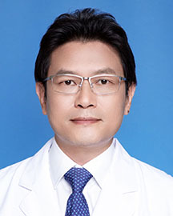

<!-- AUTO-GENERATED-BY: work/generate_obsidian_profiles.py -->

<!-- TEMPLATE: D:\workspace\信息收集整理\医生画像仓库\模板\医生画像模板.md -->

# 金浩生

## 基础信息

| 字段 | 内容 |
|---|---|
| 姓名 | 金浩生 |
| 医院 | 广东省人民医院 |
| 科室 | 肝胆外科 |
| 职称/身份 | 主任医师 |
| 来源链接 | [官网原文](https://www.gdghospital.org.cn/Expertlistt/info_itemid_24154_subjectid_105.html) |
| 采集日期 | 2026-08-14 |

## 简介/擅长

肝脏肿瘤、胆囊结石、胆囊炎、肝胆管结石、胆道肿瘤、门静脉高压症、脾脏肿瘤等疾病的诊断与治疗，能主刀完成各种肝胆脾的专科手术，现每年开展各类肝胆外科手术四百余台

## 科研项目与成果

- 学术专业领域成就 ： 曾获“中华外科青年学者奖”，主刀手术视频获得“全国中青年医师腔镜肝脏手术视频决赛”第一名，近年主持广东省自然科学基金等项目5项。

## 论文与学术产出

- 以第一作者及通讯作者发表SCI论文10余篇。

## 可包装亮点

- 中共党员，肝胆外科行政副主任（主持工作），外科第一党支部书记 外科学博士，博士生导师 主要社会兼职 ： 广东省医师协会肝胆外科分会副主任委员 广东省基层医药协会胆道外科分会主任委员 广州市抗癌协会肝胆胰肿瘤专业委员会名誉主任委员 广东省医学会肝癌分会常委 中国研究型医院学会肝胆胰外科专业委员会肝癌学组常委 广东省医学会分会肝胆胰外科分会肝癌术中消融治疗学组…
- 对肝胆脾的复杂病、疑难病、再手术病例和疾病的围手术期处理有丰富的临床经验。
- 当前打造强大的多学科肝脏肿瘤诊治平台，建立采用以免疫靶向等全身系统综合联合消融等局部治疗的方法治疗肝胆恶性...

## 重点疾病/人群标签

- 慢性病：
- 肿瘤：肿瘤、癌、靶向、肝癌、免疫、疑难、复杂、多学科
- 生殖疾病：
- 免疫/风湿：肿瘤、癌、靶向、肝癌、免疫、疑难、复杂、多学科
- 术后恢复/康复：
- 疑难重症：肿瘤、癌、靶向、肝癌、免疫、疑难、复杂、多学科

## 证据摘录

> 只摘录官网公开信息中的短句或关键字段，不复制大段原文。

- 官网身份字段：主任医师
- 官网简介/擅长：肝脏肿瘤、胆囊结石、胆囊炎、肝胆管结石、胆道肿瘤、门静脉高压症、脾脏肿瘤等疾病的诊断与治疗，能主刀完成各种肝胆脾的专科手术，现每年开展各类肝胆外科手术四百余台
- 官网亮眼经历线索：中共党员，肝胆外科行政副主任（主持工作），外科第一党支部书记 外科学博士，博士生导师 主要社会兼职 ： 广东省医师协会肝胆外科分会副主任委员 广东省基层医药协会胆道外科分会主任委员 广州市抗癌协会肝胆胰肿瘤专业委员会名誉主任委员 广东省医学会肝癌分会常委 中国研究型医院学会肝胆胰外科专业委员会肝癌学组常委 广东省医学会分会肝胆胰外科分会肝癌术中消融治疗学组副组长 广东省肝脏病协会胆胰分会委员 广东省高层次人才评审专家 专业特长 ： 一…
- 来源链接：https://www.gdghospital.org.cn/Expertlistt/info_itemid_24154_subjectid_105.html

## BD 画像摘要

金浩生医生可作为肿瘤、免疫/风湿/感染、疑难重症方向的基础画像候选。后续 BD 使用应继续以官网来源和人工复核为准，不添加疗效承诺或无来源包装。

## 合规边界

- 仅使用医院官网、官方公众号、官方小程序等公开渠道。
- 不采集私人电话、私人微信、家庭住址、患者隐私或非公开排班信息。
- 不写“保证治愈”“疗效第一”“包治疑难杂症”等无法由官网证明的表述。
