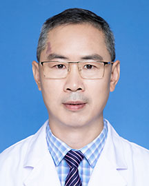

<!-- AUTO-GENERATED-BY: work/generate_obsidian_profiles.py -->

<!-- TEMPLATE: D:\workspace\信息收集整理\医生画像仓库\模板\医生画像模板.md -->

# 闵存云

## 基础信息

| 字段 | 内容 |
|---|---|
| 姓名 | 闵存云 |
| 医院 | 广东省人民医院 |
| 科室 | 中医内科 |
| 职称/身份 | 主任中医师 科主任 |
| 来源链接 | [官网原文](https://www.gdghospital.org.cn/Expertlistt/info_itemid_25409_subjectid_98.html) |
| 采集日期 | 2026-08-14 |

## 简介/擅长

1.中西医结合防治肾病综合征

## 教育与进修经历

- 中西医结合博士, 国家优秀中医临床人才，美国Baylor College of Medicine访问学者，“平安好医生”，“羊城好医生”。
- 学习工作经历 1994年毕业于云南中医学院中医系，获学士学位，1997年毕业于广州中医药大学，获中医诊断学硕士学位，2004年，毕业于中山大学，获中西医结合博士学位；
- 2014年5月-2015年5月在美国 Baylor College of Medicine做访问学者，学习糖尿病的诊治。

## 科研项目与成果

- 2004年7月至今一直在广东省人民医院中医科从事临床和科研工作。
- 科研成果 主要从事糖尿病肾病的研究。
- 主持科研项目10余项。

## 论文与学术产出

- 发表中、英文文章40余篇。
- 主编名中医经验专著《岭南名中医传承撷英》1部，参加编写《肾脏病中西医诊治精要》，《糖尿病肾病》，《岭南名中医老年病诊治经验与基础研究》和《岭南老年病防治进展》等著作。
- 先后在《广州日报》、《羊城晚报》、《健康报》、《当代健康报》、《家庭医生》、《家庭医学》等报刊上发表科普文章多篇。

## 可包装亮点

- 中西医结合博士, 国家优秀中医临床人才，美国Baylor College of Medicine访问学者，“平安好医生”，“羊城好医生”。
- 2014年5月-2015年5月在美国 Baylor College of Medicine做访问学者，学习糖尿病的诊治。
- 随后师从国医大师吕仁和，全国名中医刘茂才、（首都国医名师）张炳厚等中医学者学习肾病、糖尿病及疑难杂病的诊治。
- 发表中、英文文章40余篇。

## 重点疾病/人群标签

- 慢性病：糖尿病、慢性、代谢、不孕、风湿、红斑狼疮、类风湿、疑难、急危重
- 肿瘤：
- 生殖疾病：糖尿病、慢性、代谢、不孕、风湿、红斑狼疮、类风湿、疑难、急危重
- 免疫/风湿：糖尿病、慢性、代谢、不孕、风湿、红斑狼疮、类风湿、疑难、急危重
- 术后恢复/康复：
- 疑难重症：糖尿病、慢性、代谢、不孕、风湿、红斑狼疮、类风湿、疑难、急危重

## 证据摘录

> 只摘录官网公开信息中的短句或关键字段，不复制大段原文。

- 官网身份字段：主任中医师 科主任
- 官网简介/擅长：1.中西医结合防治肾病综合征
- 官网亮眼经历线索：中西医结合博士, 国家优秀中医临床人才，美国Baylor College of Medicine访问学者，“平安好医生”，“羊城好医生”。 2014年5月-2015年5月在美国 Baylor College of Medicine做访问学者，学习糖尿病的诊治。 随后师从国医大师吕仁和，全国名中医刘茂才、（首都国医名师）张炳厚等中医学者学习肾病、糖尿病及疑难杂病的诊治。 发表中、英文文章40余篇。
- 来源链接：https://www.gdghospital.org.cn/Expertlistt/info_itemid_25409_subjectid_98.html

## BD 画像摘要

闵存云医生可作为慢性病、生殖疾病、免疫/风湿/感染、疑难重症方向的基础画像候选。后续 BD 使用应继续以官网来源和人工复核为准，不添加疗效承诺或无来源包装。

## 合规边界

- 仅使用医院官网、官方公众号、官方小程序等公开渠道。
- 不采集私人电话、私人微信、家庭住址、患者隐私或非公开排班信息。
- 不写“保证治愈”“疗效第一”“包治疑难杂症”等无法由官网证明的表述。
