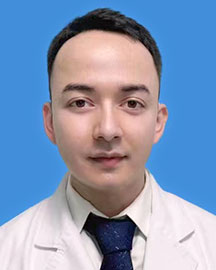

<!-- AUTO-GENERATED-BY: work/generate_obsidian_profiles.py -->

<!-- TEMPLATE: D:\workspace\信息收集整理\医生画像仓库\模板\医生画像模板.md -->

# 阿拉法特·瓦哈甫

## 基础信息

| 字段 | 内容 |
|---|---|
| 姓名 | 阿拉法特·瓦哈甫 |
| 医院 | 广东省人民医院 |
| 科室 | 神经外科 |
| 职称/身份 | 医师 |
| 来源链接 | [官网原文](https://www.gdghospital.org.cn/Expertlistt/info_itemid_46666_subjectid_11.html) |
| 采集日期 | 2026-08-14 |

## 简介/擅长

脑肿瘤、脑积水微创治疗及脊髓脊柱疾病的显微手术治疗

## 教育与进修经历

- 医学博士，埃默里大学医学院访问学者 擅长脑肿瘤、脑积水微创治疗及脊髓脊柱疾病的显微手术治疗。

## 科研项目与成果

- 主要从事胶质瘤放化疗抵抗和肿瘤蛋白互作研究，主持国家自然科学基金和广东省自然科学基金项目各1项。

## 论文与学术产出

- 参与发表包括Cell在内的SCI论文共计18篇，总计被引用210余次，以第一作者发表SCI论文5篇，最高影响因子12分。

## 可包装亮点

- 医学博士，埃默里大学医学院访问学者 擅长脑肿瘤、脑积水微创治疗及脊髓脊柱疾病的显微手术治疗。
- 主要从事胶质瘤放化疗抵抗和肿瘤蛋白互作研究，主持国家自然科学基金和广东省自然科学基金项目各1项。
- 参与发表包括Cell在内的SCI论文共计18篇，总计被引用210余次，以第一作者发表SCI论文5篇，最高影响因子12分。

## 重点疾病/人群标签

- 慢性病：
- 肿瘤：肿瘤、瘤、化疗
- 生殖疾病：
- 免疫/风湿：
- 术后恢复/康复：
- 疑难重症：

## 证据摘录

> 只摘录官网公开信息中的短句或关键字段，不复制大段原文。

- 官网身份字段：医师
- 官网简介/擅长：脑肿瘤、脑积水微创治疗及脊髓脊柱疾病的显微手术治疗
- 官网亮眼经历线索：医学博士，埃默里大学医学院访问学者 擅长脑肿瘤、脑积水微创治疗及脊髓脊柱疾病的显微手术治疗。 主要从事胶质瘤放化疗抵抗和肿瘤蛋白互作研究，主持国家自然科学基金和广东省自然科学基金项目各1项。 参与发表包括Cell在内的SCI论文共计18篇，总计被引用210余次，以第一作者发表SCI论文5篇，最高影响因子12分。
- 来源链接：https://www.gdghospital.org.cn/Expertlistt/info_itemid_46666_subjectid_11.html

## BD 画像摘要

阿拉法特·瓦哈甫医生可作为肿瘤方向的基础画像候选。后续 BD 使用应继续以官网来源和人工复核为准，不添加疗效承诺或无来源包装。

## 合规边界

- 仅使用医院官网、官方公众号、官方小程序等公开渠道。
- 不采集私人电话、私人微信、家庭住址、患者隐私或非公开排班信息。
- 不写“保证治愈”“疗效第一”“包治疑难杂症”等无法由官网证明的表述。
