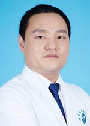

<!-- AUTO-GENERATED-BY: work/generate_obsidian_profiles.py -->

<!-- TEMPLATE: D:\workspace\信息收集整理\医生画像仓库\模板\医生画像模板.md -->

# 陈亮

## 基础信息

| 字段 | 内容 |
|---|---|
| 姓名 | 陈亮 |
| 医院 | 广东省人民医院 |
| 科室 | 新生儿科 |
| 职称/身份 | 医师 |
| 来源链接 | [官网原文](https://www.gdghospital.org.cn/Expertlistt/info_itemid_23638_subjectid_56.html) |
| 采集日期 | 2026-08-14 |

## 简介/擅长

新生儿疾病、儿科呼吸系统疾病、心血管疾病及组织工程气管研究

## 教育与进修经历

- 医学硕士，毕业于广东省心血管病研究所。

## 科研项目与成果

- 科研成果： 参与已结题广东省自然基金项目一项；
- 现正参与国家自然科学基金面上项目及广东省自然科学基金项目各一项。

## 论文与学术产出

- 发表SCI 1篇，国家级医学核心期刊论著2篇。

## 可包装亮点

- 现正参与国家自然科学基金面上项目及广东省自然科学基金项目各一项。
- 发表SCI 1篇，国家级医学核心期刊论著2篇。
- 熟练掌握新生儿呼吸、心血管病等危重症疾病诊疗。

## 重点疾病/人群标签

- 慢性病：
- 肿瘤：
- 生殖疾病：
- 免疫/风湿：
- 术后恢复/康复：
- 疑难重症：

## 证据摘录

> 只摘录官网公开信息中的短句或关键字段，不复制大段原文。

- 官网身份字段：医师
- 官网简介/擅长：新生儿疾病、儿科呼吸系统疾病、心血管疾病及组织工程气管研究
- 官网亮眼经历线索：现正参与国家自然科学基金面上项目及广东省自然科学基金项目各一项。 发表SCI 1篇，国家级医学核心期刊论著2篇。 熟练掌握新生儿呼吸、心血管病等危重症疾病诊疗。
- 异常提示：同名待甄别
- 来源链接：https://www.gdghospital.org.cn/Expertlistt/info_itemid_23638_subjectid_56.html

## BD 画像摘要

陈亮医生可作为广东省人民医院新生儿科的基础医生资料入库。当前重点方向以总底表标签为准，官网未展示的信息保持空白。

## 合规边界

- 仅使用医院官网、官方公众号、官方小程序等公开渠道。
- 不采集私人电话、私人微信、家庭住址、患者隐私或非公开排班信息。
- 不写“保证治愈”“疗效第一”“包治疑难杂症”等无法由官网证明的表述。
