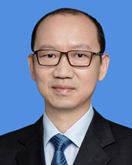

<!-- AUTO-GENERATED-BY: work/generate_obsidian_profiles.py -->

<!-- TEMPLATE: D:\workspace\信息收集整理\医生画像仓库\模板\医生画像模板.md -->

# 陈伟

## 基础信息

| 字段 | 内容 |
|---|---|
| 姓名 | 陈伟 |
| 医院 | 广东省人民医院 |
| 科室 | 胰腺中心 |
| 职称/身份 | 副主任医师 |
| 来源链接 | [官网原文](https://www.gdghospital.org.cn/Expertlistt/info_itemid_24146_subjectid_106.html) |
| 采集日期 | 2026-08-14 |

## 简介/擅长

肝脏、胆道、胰腺、脾脏各种良性疾病与恶性肿瘤的微创治疗

## 教育与进修经历

- 美国康奈尔大学休斯顿卫理公会医院访问学者，美国康奈尔大学休斯顿卫理公会医院博士后。

## 科研项目与成果

- 主持及主要参与多项省自然科学基金、省科技厅、省卫健委的科研项目，于国内、外专业学术期刊发表学术论著多篇。

## 论文与学术产出

- 主持及主要参与多项省自然科学基金、省科技厅、省卫健委的科研项目，于国内、外专业学术期刊发表学术论著多篇。

## 可包装亮点

- 美国康奈尔大学休斯顿卫理公会医院访问学者，美国康奈尔大学休斯顿卫理公会医院博士后。
- 广东省医师协会肝胆外科学组委员。
- 主持及主要参与多项省自然科学基金、省科技厅、省卫健委的科研项目，于国内、外专业学术期刊发表学术论著多篇。

## 重点疾病/人群标签

- 慢性病：
- 肿瘤：肿瘤
- 生殖疾病：
- 免疫/风湿：
- 术后恢复/康复：
- 疑难重症：

## 证据摘录

> 只摘录官网公开信息中的短句或关键字段，不复制大段原文。

- 官网身份字段：副主任医师
- 官网简介/擅长：肝脏、胆道、胰腺、脾脏各种良性疾病与恶性肿瘤的微创治疗
- 官网亮眼经历线索：美国康奈尔大学休斯顿卫理公会医院访问学者，美国康奈尔大学休斯顿卫理公会医院博士后。 广东省医师协会肝胆外科学组委员。 主持及主要参与多项省自然科学基金、省科技厅、省卫健委的科研项目，于国内、外专业学术期刊发表学术论著多篇。
- 来源链接：https://www.gdghospital.org.cn/Expertlistt/info_itemid_24146_subjectid_106.html

## BD 画像摘要

陈伟医生可作为肿瘤方向的基础画像候选。后续 BD 使用应继续以官网来源和人工复核为准，不添加疗效承诺或无来源包装。

## 合规边界

- 仅使用医院官网、官方公众号、官方小程序等公开渠道。
- 不采集私人电话、私人微信、家庭住址、患者隐私或非公开排班信息。
- 不写“保证治愈”“疗效第一”“包治疑难杂症”等无法由官网证明的表述。
