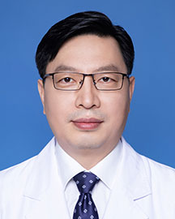

<!-- AUTO-GENERATED-BY: work/generate_obsidian_profiles.py -->

<!-- TEMPLATE: D:\workspace\信息收集整理\医生画像仓库\模板\医生画像模板.md -->

# 陈光忠

## 基础信息

| 字段 | 内容 |
|---|---|
| 姓名 | 陈光忠 |
| 医院 | 广东省人民医院 |
| 科室 | 神经外科 |
| 职称/身份 | 主任医师 |
| 来源链接 | [官网原文](https://www.gdghospital.org.cn/Expertlistt/info_itemid_24773_subjectid_11.html) |
| 采集日期 | 2026-08-14 |

## 简介/擅长

脑、脊髓血管疾病的血管内介入和外科手术治疗

## 教育与进修经历

- 中共党员，医学博士，博士研究生导师，教学主任，神经介入培训基地主任 主要社会兼职 广东省医师协会神经介入医师分会 现任主任委员 中国医师协会神经介入医师专业委员会 常务委员 中国医师协会神经介入医师专业委员会脑与脊髓血管畸形学组 组长 中国医师协会介入医师分会 委员 国家卫健委能力建设和继续教育中心神经介入专家委员会 委员 中国康复医学会脑血管病介入治疗与康复专业委员会 常务委员 广东省医师协会标准化工作专家组成员 广东省基层医药学会脑血管病介入专委会 首届主任委员 广东省医学会神经介入学分会 副主任委员 广东省…
- 美国加州大学洛杉矶分校及贝勒医学院访问学者。

## 科研项目与成果

- 主持及参与国家及省市以上科研课题10余项，主编《颅内动静脉畸形》（人民卫生出版社），以主要作者或参与专家共识及指南编写四项，参编参译专业书籍八部，以第一或通讯作者在国内外学术期刊发表专业论文50余篇。

## 论文与学术产出

- 主持及参与国家及省市以上科研课题10余项，主编《颅内动静脉畸形》（人民卫生出版社），以主要作者或参与专家共识及指南编写四项，参编参译专业书籍八部，以第一或通讯作者在国内外学术期刊发表专业论文50余篇。

## 可包装亮点

- 中共党员，医学博士，博士研究生导师，教学主任，神经介入培训基地主任 主要社会兼职 广东省医师协会神经介入医师分会 现任主任委员 中国医师协会神经介入医师专业委员会 常务委员 中国医师协会神经介入医师专业委员会脑与脊髓血管畸形学组 组长 中国医师协会介入医师分会 委员 国家卫健委能力建设和继续教育中心神经介入专家委员会 委员 中国康复医学会脑血管病介入治疗与…
- 美国加州大学洛杉矶分校及贝勒医学院访问学者。
- 2014年韩国首尔国际脑血管解剖高级研修班（PLANET...

## 重点疾病/人群标签

- 慢性病：
- 肿瘤：瘤、康复
- 生殖疾病：
- 免疫/风湿：
- 术后恢复/康复：瘤、康复
- 疑难重症：

## 证据摘录

> 只摘录官网公开信息中的短句或关键字段，不复制大段原文。

- 官网身份字段：主任医师
- 官网简介/擅长：脑、脊髓血管疾病的血管内介入和外科手术治疗
- 官网亮眼经历线索：中共党员，医学博士，博士研究生导师，教学主任，神经介入培训基地主任 主要社会兼职 广东省医师协会神经介入医师分会 现任主任委员 中国医师协会神经介入医师专业委员会 常务委员 中国医师协会神经介入医师专业委员会脑与脊髓血管畸形学组 组长 中国医师协会介入医师分会 委员 国家卫健委能力建设和继续教育中心神经介入专家委员会 委员 中国康复医学会脑血管病介入治疗与康复专业委员会 常务委员 广东省医师协会标准化工作专家组成员 广东省基层医药学会…
- 来源链接：https://www.gdghospital.org.cn/Expertlistt/info_itemid_24773_subjectid_11.html

## BD 画像摘要

陈光忠医生可作为肿瘤、术后恢复/康复方向的基础画像候选。后续 BD 使用应继续以官网来源和人工复核为准，不添加疗效承诺或无来源包装。

## 合规边界

- 仅使用医院官网、官方公众号、官方小程序等公开渠道。
- 不采集私人电话、私人微信、家庭住址、患者隐私或非公开排班信息。
- 不写“保证治愈”“疗效第一”“包治疑难杂症”等无法由官网证明的表述。
