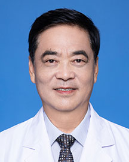

<!-- AUTO-GENERATED-BY: work/generate_obsidian_profiles.py -->

<!-- TEMPLATE: D:\workspace\信息收集整理\医生画像仓库\模板\医生画像模板.md -->

# 陈刚

## 基础信息

| 字段 | 内容 |
|---|---|
| 姓名 | 陈刚 |
| 医院 | 广东省人民医院 |
| 科室 | 胸外科 |
| 职称/身份 | 主任医师 |
| 来源链接 | [官网原文](https://www.gdghospital.org.cn/Expertlistt/info_itemid_65671_subjectid_8.html) |
| 采集日期 | 2026-08-14 |

## 简介/擅长

肺癌，食管癌，纵隔肿瘤，胸壁肿瘤，各种肺，食管良性病变，漏斗胸和鸡胸等手术治疗和胸腔镜微创手术治疗

## 科研项目与成果

- 参与编写了多本专著和临床治疗规范，主持和参加了多项国家级、省级和厅级科研项目，曾获广东省科技成果一等奖、广东省科技进步二等奖、卫生厅科技成果一等奖和卫生厅科技进步三等奖。

## 论文与学术产出

- 已发表学术论文60余篇。

## 可包装亮点

- 广东省人民医院首席专家、一级主任医师、教授、博士生导师 主要社会任职 中国研究型医院协会首届胸外科专家委员会副主任委员 广东省医师协会胸外科医师分会（第二届主任委员） 中国医师协会内镜医师分会委员暨胸腔镜专委会常委 中华医学会胸心血管分会胸腔镜外科学组委员暨肺癌学组委员 第一第二届中国医师协会胸外科分会常委暨快速康复专家委员会副主任委员 中国医促会胸外科分…
- 作为广东省人民医院胸外科首任主任，创建了省医独立的胸外科，2011年作为学科带头人带领胸外科获得第一批国家临床重点专科殊荣。
- 从事胸外科临床工作四十余年，多次赴国外著名医学中心胸外科临床专业研修，对胸外科各种疾病和复杂疑难病症的诊治积累了深厚的...

## 重点疾病/人群标签

- 慢性病：
- 肿瘤：肿瘤、癌、肺癌、康复、疑难、复杂
- 生殖疾病：
- 免疫/风湿：
- 术后恢复/康复：肿瘤、癌、肺癌、康复、疑难、复杂
- 疑难重症：肿瘤、癌、肺癌、康复、疑难、复杂

## 证据摘录

> 只摘录官网公开信息中的短句或关键字段，不复制大段原文。

- 官网身份字段：主任医师
- 官网简介/擅长：肺癌，食管癌，纵隔肿瘤，胸壁肿瘤，各种肺，食管良性病变，漏斗胸和鸡胸等手术治疗和胸腔镜微创手术治疗
- 官网亮眼经历线索：广东省人民医院首席专家、一级主任医师、教授、博士生导师 主要社会任职 中国研究型医院协会首届胸外科专家委员会副主任委员 广东省医师协会胸外科医师分会（第二届主任委员） 中国医师协会内镜医师分会委员暨胸腔镜专委会常委 中华医学会胸心血管分会胸腔镜外科学组委员暨肺癌学组委员 第一第二届中国医师协会胸外科分会常委暨快速康复专家委员会副主任委员 中国医促会胸外科分会常委 广东省医学会胸外科分会顾问（首届胸外科分会副主委） 广东省抗癌协会食管癌…
- 来源链接：https://www.gdghospital.org.cn/Expertlistt/info_itemid_65671_subjectid_8.html

## BD 画像摘要

陈刚医生可作为肿瘤、术后恢复/康复、疑难重症方向的基础画像候选。后续 BD 使用应继续以官网来源和人工复核为准，不添加疗效承诺或无来源包装。

## 合规边界

- 仅使用医院官网、官方公众号、官方小程序等公开渠道。
- 不采集私人电话、私人微信、家庭住址、患者隐私或非公开排班信息。
- 不写“保证治愈”“疗效第一”“包治疑难杂症”等无法由官网证明的表述。
