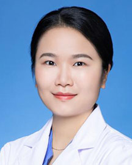

<!-- AUTO-GENERATED-BY: work/generate_obsidian_profiles.py -->

<!-- TEMPLATE: D:\workspace\信息收集整理\医生画像仓库\模板\医生画像模板.md -->

# 陈博

## 基础信息

| 字段 | 内容 |
|---|---|
| 姓名 | 陈博 |
| 医院 | 广东省人民医院 |
| 科室 | 乳腺肿瘤科 |
| 职称/身份 | 医师 |
| 来源链接 | [官网原文](https://www.gdghospital.org.cn/Expertlistt/info_itemid_56677_subjectid_30.html) |
| 采集日期 | 2026-08-14 |

## 简介/擅长

乳腺癌早期诊断和综合治疗，致力于为乳腺癌患者提供精准个体化治疗

## 教育与进修经历

- 中共党员，医学博士 广东省人民医院乳腺肿瘤科，副研究员，医师 华南理工大学硕士研究生导师，南方医科大学硕士研究生导师 教育经历和专业特长 ： 2018年毕业于中山大学肿瘤防治中心，获临床医学（肿瘤学）博士学位。
- 2019 年“35 under 35”优秀青年肿瘤医师风采展示活动“最具潜力青年肿瘤医生” 2013届湖南省普通高校优秀毕业生；

## 科研项目与成果

- 获批中国发明专利3项。
- 相关研究成果多次于ASCO，ESMO，SSO，SABCS，AACR等重要国际学术会议进行展示。
- 科研立项及个人荣誉 ： 主持国家自然科学基金2项。
- 主持广东省自然科学基金面上项目，广州市科技项目，登峰计划项目，中央高校业务费面上项目，广东省医学科学技术研究基金项目,博士启动项目各1项。

## 论文与学术产出

- 以第一/通讯作者身份（含共同）发表SCI论文50余篇，其中影响因子＞10分的6篇。

## 可包装亮点

- 熟练掌握乳腺常见疾病的诊治，擅长乳腺癌早期诊断和综合治疗，致力于为乳腺癌患者提供精准个体化治疗。
- 社会兼职与学术成就 ： 曾担任中国临床肿瘤学会（CSCO）乳腺癌专家委员 委员；
- 广东省药理学会肿瘤药理专业委员会 委员；
- 广州抗癌协会乳腺癌分会 委员兼秘书；

## 重点疾病/人群标签

- 慢性病：
- 肿瘤：肿瘤、癌、乳腺癌
- 生殖疾病：
- 免疫/风湿：
- 术后恢复/康复：
- 疑难重症：

## 证据摘录

> 只摘录官网公开信息中的短句或关键字段，不复制大段原文。

- 官网身份字段：医师
- 官网简介/擅长：乳腺癌早期诊断和综合治疗，致力于为乳腺癌患者提供精准个体化治疗
- 官网亮眼经历线索：熟练掌握乳腺常见疾病的诊治，擅长乳腺癌早期诊断和综合治疗，致力于为乳腺癌患者提供精准个体化治疗。 社会兼职与学术成就 ： 曾担任中国临床肿瘤学会（CSCO）乳腺癌专家委员 委员； 广东省药理学会肿瘤药理专业委员会 委员； 广州抗癌协会乳腺癌分会 委员兼秘书；
- 来源链接：https://www.gdghospital.org.cn/Expertlistt/info_itemid_56677_subjectid_30.html

## BD 画像摘要

陈博医生可作为肿瘤方向的基础画像候选。后续 BD 使用应继续以官网来源和人工复核为准，不添加疗效承诺或无来源包装。

## 合规边界

- 仅使用医院官网、官方公众号、官方小程序等公开渠道。
- 不采集私人电话、私人微信、家庭住址、患者隐私或非公开排班信息。
- 不写“保证治愈”“疗效第一”“包治疑难杂症”等无法由官网证明的表述。
