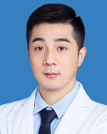

<!-- AUTO-GENERATED-BY: work/generate_obsidian_profiles.py -->

<!-- TEMPLATE: D:\workspace\信息收集整理\医生画像仓库\模板\医生画像模板.md -->

# 陈圣攀

## 基础信息

| 字段 | 内容 |
|---|---|
| 姓名 | 陈圣攀 |
| 医院 | 广东省人民医院 |
| 科室 | 神经外科 |
| 职称/身份 | 医师 |
| 来源链接 | [官网原文](https://www.gdghospital.org.cn/Expertlistt/info_itemid_46668_subjectid_11.html) |
| 采集日期 | 2026-08-14 |

## 简介/擅长

熟练掌握脑肿瘤、脑积水等神经外科常见疾病诊治，尤其擅长脑和脊髓血管疾病的 神经介入和显微外科治疗，包括脑动脉瘤、脑动静脉畸形、硬脑膜动静脉瘘、脑出 血、脑梗塞、硬脑膜下血肿、脊髓血管畸形、硬脊膜动静脉瘘、颈动脉和椎基底动 脉狭窄等

## 教育与进修经历

- 简介 医学博士，医学博士后，留美访问学者，毕业于首都医科大学宣武医院，师从国内 著名神经外科及介入神经放射专家张鹏教授以及张鸿祺教授。
- 2017-2018年美国 Loma Linda大学医学院访问学者，师从国际华人脑卒中同盟创办人兼主席John H. Zhang教授。
- 担任国家卫健委能力建设和继 续教育中心神经介入进修与培训基地（广东省人民医院）秘书、广东省基层医药学 会脑血管病介入专委会秘书、广东省医疗器械管理学会医疗器械临床试验专委会会 员等职务。

## 科研项目与成果

- 以第 一作者或通讯作者发表SCI论文10余篇，主持国家自然科学基金课题1项，省部级 课题3项。

## 论文与学术产出

- 以第 一作者或通讯作者发表SCI论文10余篇，主持国家自然科学基金课题1项，省部级 课题3项。

## 可包装亮点

- 简介 医学博士，医学博士后，留美访问学者，毕业于首都医科大学宣武医院，师从国内 著名神经外科及介入神经放射专家张鹏教授以及张鸿祺教授。
- 2017-2018年美国 Loma Linda大学医学院访问学者，师从国际华人脑卒中同盟创办人兼主席John H. Zhang教授。
- 以第 一作者或通讯作者发表SCI论文10余篇，主持国家自然科学基金课题1项，省部级 课题3项。
- 担任国家卫健委能力建设和继 续教育中心神经介入进修与培训基地（广东省人民医院）秘书、广东省基层医药学 会脑血管病介入专委会秘书、广东省医疗器械管理学会医疗器械临床试验专委会会 员等职务。

## 重点疾病/人群标签

- 慢性病：
- 肿瘤：肿瘤、瘤
- 生殖疾病：
- 免疫/风湿：
- 术后恢复/康复：
- 疑难重症：

## 证据摘录

> 只摘录官网公开信息中的短句或关键字段，不复制大段原文。

- 官网身份字段：医师
- 官网简介/擅长：熟练掌握脑肿瘤、脑积水等神经外科常见疾病诊治，尤其擅长脑和脊髓血管疾病的 神经介入和显微外科治疗，包括脑动脉瘤、脑动静脉畸形、硬脑膜动静脉瘘、脑出 血、脑梗塞、硬脑膜下血肿、脊髓血管畸形、硬脊膜动静脉瘘、颈动脉和椎基底动 脉狭窄等
- 官网亮眼经历线索：简介 医学博士，医学博士后，留美访问学者，毕业于首都医科大学宣武医院，师从国内 著名神经外科及介入神经放射专家张鹏教授以及张鸿祺教授。 2017-2018年美国 Loma Linda大学医学院访问学者，师从国际华人脑卒中同盟创办人兼主席John H. Zhang教授。 以第 一作者或通讯作者发表SCI论文10余篇，主持国家自然科学基金课题1项，省部级 课题3项。 担任国家卫健委能力建设和继 续教育中心神经介入进修与培训基地（广东省人民…
- 来源链接：https://www.gdghospital.org.cn/Expertlistt/info_itemid_46668_subjectid_11.html

## BD 画像摘要

陈圣攀医生可作为肿瘤方向的基础画像候选。后续 BD 使用应继续以官网来源和人工复核为准，不添加疗效承诺或无来源包装。

## 合规边界

- 仅使用医院官网、官方公众号、官方小程序等公开渠道。
- 不采集私人电话、私人微信、家庭住址、患者隐私或非公开排班信息。
- 不写“保证治愈”“疗效第一”“包治疑难杂症”等无法由官网证明的表述。
