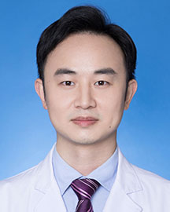

<!-- AUTO-GENERATED-BY: work/generate_obsidian_profiles.py -->

<!-- TEMPLATE: D:\workspace\信息收集整理\医生画像仓库\模板\医生画像模板.md -->

# 陈宇清

## 基础信息

| 字段 | 内容 |
|---|---|
| 姓名 | 陈宇清 |
| 医院 | 广东省人民医院 |
| 科室 | 中医内科 |
| 职称/身份 | 医师 |
| 来源链接 | [官网原文](https://www.gdghospital.org.cn/Expertlistt/info_itemid_34601_subjectid_98.html) |
| 采集日期 | 2026-08-14 |

## 简介/擅长

病种 ：善于综合治疗头颈部肿瘤，呼吸、消化系统恶性肿瘤，运动损伤、中风及神经损伤后遗症及各关节疼痛类疾患，耳鸣，鼻咽炎，咳嗽，失眠，虚劳调理，并指导饮食及运动康复

## 教育与进修经历

- 中共党员，医学博士 2014年获得广州中医药大学针灸康复专业硕士学位，2017年获得广州中医药大学中西医结合专业肿瘤方向博士学位，2019年广州医科大学耳鼻喉头颈外科学博士后经历。
- 学术任职 ：中国针灸学会，小儿推拿专业委员会 委员 广东省医师协会，耳鼻咽喉科医师分会 会员 中国针灸学会 会员 课题情况 ：主持中国博士后面上课题1项，广东省博士科研启动项目1项，参与国家自然科学基金课题多项。

## 科研项目与成果

- 学术任职 ：中国针灸学会，小儿推拿专业委员会 委员 广东省医师协会，耳鼻咽喉科医师分会 会员 中国针灸学会 会员 课题情况 ：主持中国博士后面上课题1项，广东省博士科研启动项目1项，参与国家自然科学基金课题多项。

## 论文与学术产出

- 发表中文核心期刊及SCI论文10余篇。

## 可包装亮点

- 学术任职 ：中国针灸学会，小儿推拿专业委员会 委员 广东省医师协会，耳鼻咽喉科医师分会 会员 中国针灸学会 会员 课题情况 ：主持中国博士后面上课题1项，广东省博士科研启动项目1项，参与国家自然科学基金课题多项。
- 发表中文核心期刊及SCI论文10余篇。

## 重点疾病/人群标签

- 慢性病：
- 肿瘤：肿瘤、康复、疼痛
- 生殖疾病：
- 免疫/风湿：
- 术后恢复/康复：肿瘤、康复、疼痛
- 疑难重症：

## 证据摘录

> 只摘录官网公开信息中的短句或关键字段，不复制大段原文。

- 官网身份字段：医师
- 官网简介/擅长：病种 ：善于综合治疗头颈部肿瘤，呼吸、消化系统恶性肿瘤，运动损伤、中风及神经损伤后遗症及各关节疼痛类疾患，耳鸣，鼻咽炎，咳嗽，失眠，虚劳调理，并指导饮食及运动康复
- 官网亮眼经历线索：学术任职 ：中国针灸学会，小儿推拿专业委员会 委员 广东省医师协会，耳鼻咽喉科医师分会 会员 中国针灸学会 会员 课题情况 ：主持中国博士后面上课题1项，广东省博士科研启动项目1项，参与国家自然科学基金课题多项。 发表中文核心期刊及SCI论文10余篇。
- 来源链接：https://www.gdghospital.org.cn/Expertlistt/info_itemid_34601_subjectid_98.html

## BD 画像摘要

陈宇清医生可作为肿瘤、术后恢复/康复方向的基础画像候选。后续 BD 使用应继续以官网来源和人工复核为准，不添加疗效承诺或无来源包装。

## 合规边界

- 仅使用医院官网、官方公众号、官方小程序等公开渠道。
- 不采集私人电话、私人微信、家庭住址、患者隐私或非公开排班信息。
- 不写“保证治愈”“疗效第一”“包治疑难杂症”等无法由官网证明的表述。
