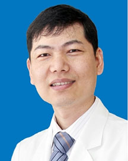

<!-- AUTO-GENERATED-BY: work/generate_obsidian_profiles.py -->

<!-- TEMPLATE: D:\workspace\信息收集整理\医生画像仓库\模板\医生画像模板.md -->

# 陈寄梅

## 基础信息

| 字段 | 内容 |
|---|---|
| 姓名 | 陈寄梅 |
| 医院 | 广东省人民医院 |
| 科室 | 心外科 |
| 职称/身份 | 主任医师 心研所所长 |
| 来源链接 | [官网原文](https://www.gdghospital.org.cn/Expertlistt/info_itemid_24344_subjectid_80.html) |
| 采集日期 | 2026-08-14 |

## 简介/擅长

各类儿童复杂心脏病的手术，尤其对成人先心病具有丰富的临床经验

## 教育与进修经历

- 先后在美国、德国、日本著名医学机构进修。
- 担任Annals of Thoracic Surgery心外科分册中文版副主编、中华胸心血管外科杂志编委、国家自然科学基金评审专家、教育部学位中心评议专家。

## 科研项目与成果

- 擅长领域 ：国家临床重点专科项目负责人、心血管国家区域医疗中心建设骨干、广东省医学领军人才。
- 科研成果 ： 主持国家重点研发计划项目，参与TOF-Life国际多中心研究，发表论文211篇，包括Circulation在内的 SCI 论文21 篇。
- 担任Annals of Thoracic Surgery心外科分册中文版副主编、中华胸心血管外科杂志编委、国家自然科学基金评审专家、教育部学位中心评议专家。

## 论文与学术产出

- 科研成果 ： 主持国家重点研发计划项目，参与TOF-Life国际多中心研究，发表论文211篇，包括Circulation在内的 SCI 论文21 篇。
- 担任Annals of Thoracic Surgery心外科分册中文版副主编、中华胸心血管外科杂志编委、国家自然科学基金评审专家、教育部学位中心评议专家。

## 可包装亮点

- 医学博士 博士生导师 心研所所长、心外科与先天性心脏病外科学科带头人 荣获“中国好医生”“广东好医生”“岭南名医”等光荣称号。
- 在先心病防治领域成绩卓著，获“宋庆龄儿科医学奖”。
- 先后在美国、德国、日本著名医学机构进修。
- 担任中国医师协会心血管外科医师分会副会长、中华医学会胸心血管外科学分会常务委员、中国研究型医院学会体外生命支持与循环专委会主任委员、广东省医学会心血管外科学分会主任委员。

## 重点疾病/人群标签

- 慢性病：
- 肿瘤：
- 生殖疾病：
- 免疫/风湿：
- 术后恢复/康复：
- 疑难重症：复杂

## 证据摘录

> 只摘录官网公开信息中的短句或关键字段，不复制大段原文。

- 官网身份字段：主任医师 心研所所长
- 官网简介/擅长：各类儿童复杂心脏病的手术，尤其对成人先心病具有丰富的临床经验
- 官网亮眼经历线索：医学博士 博士生导师 心研所所长、心外科与先天性心脏病外科学科带头人 荣获“中国好医生”“广东好医生”“岭南名医”等光荣称号。 在先心病防治领域成绩卓著，获“宋庆龄儿科医学奖”。 先后在美国、德国、日本著名医学机构进修。 担任中国医师协会心血管外科医师分会副会长、中华医学会胸心血管外科学分会常务委员、中国研究型医院学会体外生命支持与循环专委会主任委员、广东省医学会心血管外科学分会主任委员。
- 来源链接：https://www.gdghospital.org.cn/Expertlistt/info_itemid_24344_subjectid_80.html

## BD 画像摘要

陈寄梅医生可作为疑难重症方向的基础画像候选。后续 BD 使用应继续以官网来源和人工复核为准，不添加疗效承诺或无来源包装。

## 合规边界

- 仅使用医院官网、官方公众号、官方小程序等公开渠道。
- 不采集私人电话、私人微信、家庭住址、患者隐私或非公开排班信息。
- 不写“保证治愈”“疗效第一”“包治疑难杂症”等无法由官网证明的表述。
