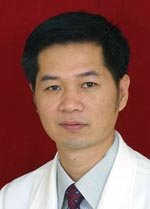

<!-- AUTO-GENERATED-BY: work/generate_obsidian_profiles.py -->

<!-- TEMPLATE: D:\workspace\信息收集整理\医生画像仓库\模板\医生画像模板.md -->

# 陈少华

## 基础信息

| 字段 | 内容 |
|---|---|
| 姓名 | 陈少华 |
| 医院 | 广东省人民医院 |
| 科室 | 鼻科 |
| 职称/身份 | 主任医师 |
| 来源链接 | [官网原文](https://www.gdghospital.org.cn/Expertlistt/info_itemid_24945_subjectid_110.html) |
| 采集日期 | 2026-08-14 |

## 简介/擅长

于鼻腔疾病如鼻炎、鼻窦炎、鼻出血及鼻腔肿瘤的诊断治疗，在鼻内窥镜手术方面有较高造诣

## 科研项目与成果

- 参与完成国家科研项目一项，主持完成省科委、省卫生厅的科研多项。

## 可包装亮点

- 教授、硕士生导师。
- 中华医师协会耳鼻喉分会委员，广东省医学会耳鼻喉学会副主任委员，中华医师协会广东省耳鼻咽喉分会副主任委员，泛亚面部整形美容外科学会（PAAFPRS）中国区常务委员。
- 多次到瑞典、德国等欧洲国家访问学习。
- 对耳鼻喉科常见病多发病有丰富的临床治疗经验，在国内率先建立了鼾症微创治疗中心及过敏性疾病治疗中心。

## 重点疾病/人群标签

- 慢性病：
- 肿瘤：肿瘤
- 生殖疾病：
- 免疫/风湿：
- 术后恢复/康复：
- 疑难重症：

## 证据摘录

> 只摘录官网公开信息中的短句或关键字段，不复制大段原文。

- 官网身份字段：主任医师
- 官网简介/擅长：于鼻腔疾病如鼻炎、鼻窦炎、鼻出血及鼻腔肿瘤的诊断治疗，在鼻内窥镜手术方面有较高造诣
- 官网亮眼经历线索：教授、硕士生导师。 中华医师协会耳鼻喉分会委员，广东省医学会耳鼻喉学会副主任委员，中华医师协会广东省耳鼻咽喉分会副主任委员，泛亚面部整形美容外科学会（PAAFPRS）中国区常务委员。 多次到瑞典、德国等欧洲国家访问学习。 对耳鼻喉科常见病多发病有丰富的临床治疗经验，在国内率先建立了鼾症微创治疗中心及过敏性疾病治疗中心。
- 来源链接：https://www.gdghospital.org.cn/Expertlistt/info_itemid_24945_subjectid_110.html

## BD 画像摘要

陈少华医生可作为肿瘤方向的基础画像候选。后续 BD 使用应继续以官网来源和人工复核为准，不添加疗效承诺或无来源包装。

## 合规边界

- 仅使用医院官网、官方公众号、官方小程序等公开渠道。
- 不采集私人电话、私人微信、家庭住址、患者隐私或非公开排班信息。
- 不写“保证治愈”“疗效第一”“包治疑难杂症”等无法由官网证明的表述。
