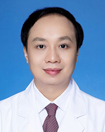

<!-- AUTO-GENERATED-BY: work/generate_obsidian_profiles.py -->

<!-- TEMPLATE: D:\workspace\信息收集整理\医生画像仓库\模板\医生画像模板.md -->

# 陈永新

## 基础信息

| 字段 | 内容 |
|---|---|
| 姓名 | 陈永新 |
| 医院 | 广东省人民医院 |
| 科室 | 普通儿科 |
| 职称/身份 | 主任医师 |
| 来源链接 | [官网原文](https://www.gdghospital.org.cn/Expertlistt/info_itemid_25015_subjectid_55.html) |
| 采集日期 | 2026-08-14 |

## 简介/擅长

于支气管哮喘、小儿慢性咳嗽、反复呼吸道感染、各种肺炎、气管支气管炎和儿童阻塞性睡眠呼吸暂停综合征以及呼吸系统少见病的诊治

## 科研项目与成果

- 主持及参与完成多项广东省科研项目，在核心期刊（包括SCI期刊）发表学术论文多篇。

## 论文与学术产出

- 主持及参与完成多项广东省科研项目，在核心期刊（包括SCI期刊）发表学术论文多篇。

## 可包装亮点

- 医学硕士，广东省儿科呼吸联盟副理事长，广东省临床医学学会儿科呼吸专业委员会常委，广东省生物医学工程学会儿科和临床工程分会常委，广东省医学会儿科分会呼吸学组委员，广东省医学会变态反应分会儿童过敏与哮喘学组委员，广东省中医药学会儿科专业委员会委员。
- 对儿科疑难杂症有较好的诊治心得。
- 主持及参与完成多项广东省科研项目，在核心期刊（包括SCI期刊）发表学术论文多篇。

## 重点疾病/人群标签

- 慢性病：慢性、感染、疑难
- 肿瘤：
- 生殖疾病：
- 免疫/风湿：慢性、感染、疑难
- 术后恢复/康复：
- 疑难重症：慢性、感染、疑难

## 证据摘录

> 只摘录官网公开信息中的短句或关键字段，不复制大段原文。

- 官网身份字段：主任医师
- 官网简介/擅长：于支气管哮喘、小儿慢性咳嗽、反复呼吸道感染、各种肺炎、气管支气管炎和儿童阻塞性睡眠呼吸暂停综合征以及呼吸系统少见病的诊治
- 官网亮眼经历线索：医学硕士，广东省儿科呼吸联盟副理事长，广东省临床医学学会儿科呼吸专业委员会常委，广东省生物医学工程学会儿科和临床工程分会常委，广东省医学会儿科分会呼吸学组委员，广东省医学会变态反应分会儿童过敏与哮喘学组委员，广东省中医药学会儿科专业委员会委员。 对儿科疑难杂症有较好的诊治心得。 主持及参与完成多项广东省科研项目，在核心期刊（包括SCI期刊）发表学术论文多篇。
- 来源链接：https://www.gdghospital.org.cn/Expertlistt/info_itemid_25015_subjectid_55.html

## BD 画像摘要

陈永新医生可作为慢性病、免疫/风湿/感染、疑难重症方向的基础画像候选。后续 BD 使用应继续以官网来源和人工复核为准，不添加疗效承诺或无来源包装。

## 合规边界

- 仅使用医院官网、官方公众号、官方小程序等公开渠道。
- 不采集私人电话、私人微信、家庭住址、患者隐私或非公开排班信息。
- 不写“保证治愈”“疗效第一”“包治疑难杂症”等无法由官网证明的表述。
