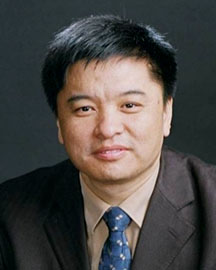

<!-- AUTO-GENERATED-BY: work/generate_obsidian_profiles.py -->

<!-- TEMPLATE: D:\workspace\信息收集整理\医生画像仓库\模板\医生画像模板.md -->

# 陈汝福

## 基础信息

| 字段 | 内容 |
|---|---|
| 姓名 | 陈汝福 |
| 医院 | 广东省人民医院 |
| 科室 | 胰腺中心 |
| 职称/身份 | 主任医师 |
| 来源链接 | [官网原文](https://www.gdghospital.org.cn/Expertlistt/info_itemid_24159_subjectid_106.html) |
| 采集日期 | 2026-08-14 |

## 简介/擅长

胰腺癌、胰腺神经内分泌肿瘤、胰腺囊性肿瘤、急慢性胰腺炎、壶腹部周围恶性肿瘤、胆管癌、十二指肠肿瘤、肝癌及肝胆管、胰管结石的诊断和微创手术治疗

## 教育与进修经历

- 中共党员，广东省医学科学院副院长、大外科行政主任 胰腺中心行政主任，胰腺中心学科带头人 医学博士，博士后，教授/主任医师，博士生导师 广东省医学领军人才，中国名医百强榜胰腺外科Top 10，岭南名医 主要社会兼职 ： 广东省基层医药学会会长 中国抗癌协会胰腺癌微创与综合治疗分会主委 中国抗癌协会胰腺癌专委会副主委 中国医师协会胰腺病学专委会副主委；

## 科研项目与成果

- 学术专业领域成就 ： 近年来获省部级科技成果奖3项，以第一作者或通讯作者发表论著150余篇，其中SCI论著50余篇，影响因子大于10分的原创性论著5篇。
- 国家自然科学基金面上项目3项，国家高科技计划(863)2项，省部级课题11项，广东省人民医院“登峰计划专项”临床科学家人才引进项目及重点项目。

## 论文与学术产出

- 学术专业领域成就 ： 近年来获省部级科技成果奖3项，以第一作者或通讯作者发表论著150余篇，其中SCI论著50余篇，影响因子大于10分的原创性论著5篇。
- 担任《中华肝脏外科手术学电子杂志》、《中华外科杂志》、《中华胰腺病杂志》等12种学术期刊的编委和常务编委。

## 可包装亮点

- 中共党员，广东省医学科学院副院长、大外科行政主任 胰腺中心行政主任，胰腺中心学科带头人 医学博士，博士后，教授/主任医师，博士生导师 广东省医学领军人才，中国名医百强榜胰腺外科Top 10，岭南名医 主要社会兼职 ： 广东省基层医药学会会长 中国抗癌协会胰腺癌微创与综合治疗分会主委 中国抗癌协会胰腺癌专委会副主委 中国医师协会胰腺病学专委会副主委；
- 中国医促会胰腺疾病分会副主委 中国医药教育学会腹部肿瘤专委会副主委 广东省医师协会胰腺病专业医师分会主委 广东省基层医药学会肝胆胰微创分会主委 广东省抗癌协会胰腺癌专委会主委 广东省医学会外科学分会副主委 教育经历和专业特长 ： 擅长胰腺癌、胰腺神经内分泌肿瘤、胰腺囊性肿瘤、急慢性胰腺炎、壶腹部周围恶性肿瘤、胆管癌、十二指肠肿瘤、肝癌及肝胆管、胰管结石的诊…
- 对不同分期的胰腺癌患者建立了规范化、个体化、综合化的精准诊治流程。
- 学术专业领域成就 ： 近年来获省部级...

## 重点疾病/人群标签

- 慢性病：慢性、肿瘤、癌、肝癌
- 肿瘤：慢性、肿瘤、癌、肝癌
- 生殖疾病：
- 免疫/风湿：
- 术后恢复/康复：
- 疑难重症：

## 证据摘录

> 只摘录官网公开信息中的短句或关键字段，不复制大段原文。

- 官网身份字段：主任医师
- 官网简介/擅长：胰腺癌、胰腺神经内分泌肿瘤、胰腺囊性肿瘤、急慢性胰腺炎、壶腹部周围恶性肿瘤、胆管癌、十二指肠肿瘤、肝癌及肝胆管、胰管结石的诊断和微创手术治疗
- 官网亮眼经历线索：中共党员，广东省医学科学院副院长、大外科行政主任 胰腺中心行政主任，胰腺中心学科带头人 医学博士，博士后，教授/主任医师，博士生导师 广东省医学领军人才，中国名医百强榜胰腺外科Top 10，岭南名医 主要社会兼职 ： 广东省基层医药学会会长 中国抗癌协会胰腺癌微创与综合治疗分会主委 中国抗癌协会胰腺癌专委会副主委 中国医师协会胰腺病学专委会副主委； 中国医促会胰腺疾病分会副主委 中国医药教育学会腹部肿瘤专委会副主委 广东省医师协会胰腺…
- 来源链接：https://www.gdghospital.org.cn/Expertlistt/info_itemid_24159_subjectid_106.html

## BD 画像摘要

陈汝福医生可作为慢性病、肿瘤方向的基础画像候选。后续 BD 使用应继续以官网来源和人工复核为准，不添加疗效承诺或无来源包装。

## 合规边界

- 仅使用医院官网、官方公众号、官方小程序等公开渠道。
- 不采集私人电话、私人微信、家庭住址、患者隐私或非公开排班信息。
- 不写“保证治愈”“疗效第一”“包治疑难杂症”等无法由官网证明的表述。
