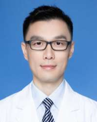

<!-- AUTO-GENERATED-BY: work/generate_obsidian_profiles.py -->

<!-- TEMPLATE: D:\workspace\信息收集整理\医生画像仓库\模板\医生画像模板.md -->

# 陈泽文

## 基础信息

| 字段 | 内容 |
|---|---|
| 姓名 | 陈泽文 |
| 医院 | 广东省人民医院 |
| 科室 | 心外科 |
| 职称/身份 | 主治医师 |
| 来源链接 | [官网原文](https://www.gdghospital.org.cn/Expertlistt/info_itemid_59593_subjectid_80.html) |
| 采集日期 | 2026-08-14 |

## 简介/擅长

擅长简单型先天性心脏病的微创治疗、复杂型先天性心脏病的外科综合治疗，以及 心脏瓣膜病、冠状动脉疾病和主动脉疾病的诊疗

## 教育与进修经历

- 简介 医学博士，毕业广东省心血管病研究所，师从中华医学会胸心血管外科分会前任主 委庄建教授。
- 美国纽约-长老会医院康奈尔医疗中心（全美心外科排名第5）和美国 Loma Linda大学医学院（全美儿童心外科排名第10）访问学者。

## 科研项目与成果

- 现任 广东省人民医院先天性心脏病产前产后一体化诊疗中心委员，主持国家自然科学基 金青年基金1项，并参与我国先天性心脏病诊疗指南的撰写工作。

## 可包装亮点

- 简介 医学博士，毕业广东省心血管病研究所，师从中华医学会胸心血管外科分会前任主 委庄建教授。
- 美国纽约-长老会医院康奈尔医疗中心（全美心外科排名第5）和美国 Loma Linda大学医学院（全美儿童心外科排名第10）访问学者。
- 现任 广东省人民医院先天性心脏病产前产后一体化诊疗中心委员，主持国家自然科学基 金青年基金1项，并参与我国先天性心脏病诊疗指南的撰写工作。
- 荣誉奖励 荣获中华医学会胸心血管外科青年委员会青年医师手术技能大赛（南区）第一名。

## 重点疾病/人群标签

- 慢性病：
- 肿瘤：
- 生殖疾病：
- 免疫/风湿：
- 术后恢复/康复：
- 疑难重症：复杂

## 证据摘录

> 只摘录官网公开信息中的短句或关键字段，不复制大段原文。

- 官网身份字段：主治医师
- 官网简介/擅长：擅长简单型先天性心脏病的微创治疗、复杂型先天性心脏病的外科综合治疗，以及 心脏瓣膜病、冠状动脉疾病和主动脉疾病的诊疗
- 官网亮眼经历线索：简介 医学博士，毕业广东省心血管病研究所，师从中华医学会胸心血管外科分会前任主 委庄建教授。 美国纽约-长老会医院康奈尔医疗中心（全美心外科排名第5）和美国 Loma Linda大学医学院（全美儿童心外科排名第10）访问学者。 现任 广东省人民医院先天性心脏病产前产后一体化诊疗中心委员，主持国家自然科学基 金青年基金1项，并参与我国先天性心脏病诊疗指南的撰写工作。 荣誉奖励 荣获中华医学会胸心血管外科青年委员会青年医师手术技能大赛（南…
- 来源链接：https://www.gdghospital.org.cn/Expertlistt/info_itemid_59593_subjectid_80.html

## BD 画像摘要

陈泽文医生可作为疑难重症方向的基础画像候选。后续 BD 使用应继续以官网来源和人工复核为准，不添加疗效承诺或无来源包装。

## 合规边界

- 仅使用医院官网、官方公众号、官方小程序等公开渠道。
- 不采集私人电话、私人微信、家庭住址、患者隐私或非公开排班信息。
- 不写“保证治愈”“疗效第一”“包治疑难杂症”等无法由官网证明的表述。
