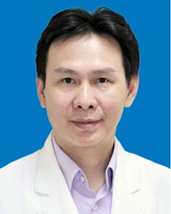

<!-- AUTO-GENERATED-BY: work/generate_obsidian_profiles.py -->

<!-- TEMPLATE: D:\workspace\信息收集整理\医生画像仓库\模板\医生画像模板.md -->

# 陈竹君

## 基础信息

| 字段 | 内容 |
|---|---|
| 姓名 | 陈竹君 |
| 医院 | 广东省人民医院 |
| 科室 | 心血管内科 |
| 职称/身份 | 主任医师 |
| 来源链接 | [官网原文](https://www.gdghospital.org.cn/Expertlistt/info_itemid_25471_subjectid_79.html) |
| 采集日期 | 2026-08-14 |

## 简介/擅长

于冠心病诊断和治疗，在冠狀动脉支架植入治疗手术方面有着丰富的经验和手术技巧

## 科研项目与成果

- 内科心血管专业硕士，广东省放射介入医师协会委员，广东省医师协会重症医学医师工作委员会委员，曾获广东省科技研究成果二等奖一项（2006年），目前主持或负责省科委科研项目三项，参与国际、国内多中心临床多项。

## 可包装亮点

- 八区主任 从事心血管内科临床工作，并有多年危重病区工作经历，有扎实的专业理论基础和丰富的临床经验，熟练处理心血管专业的危重病人和疑难病人。
- 内科心血管专业硕士，广东省放射介入医师协会委员，广东省医师协会重症医学医师工作委员会委员，曾获广东省科技研究成果二等奖一项（2006年），目前主持或负责省科委科研项目三项，参与国际、国内多中心临床多项。

## 重点疾病/人群标签

- 慢性病：冠心病、疑难、危重、重症
- 肿瘤：
- 生殖疾病：
- 免疫/风湿：
- 术后恢复/康复：
- 疑难重症：冠心病、疑难、危重、重症

## 证据摘录

> 只摘录官网公开信息中的短句或关键字段，不复制大段原文。

- 官网身份字段：主任医师
- 官网简介/擅长：于冠心病诊断和治疗，在冠狀动脉支架植入治疗手术方面有着丰富的经验和手术技巧
- 官网亮眼经历线索：八区主任 从事心血管内科临床工作，并有多年危重病区工作经历，有扎实的专业理论基础和丰富的临床经验，熟练处理心血管专业的危重病人和疑难病人。 内科心血管专业硕士，广东省放射介入医师协会委员，广东省医师协会重症医学医师工作委员会委员，曾获广东省科技研究成果二等奖一项（2006年），目前主持或负责省科委科研项目三项，参与国际、国内多中心临床多项。
- 来源链接：https://www.gdghospital.org.cn/Expertlistt/info_itemid_25471_subjectid_79.html

## BD 画像摘要

陈竹君医生可作为慢性病、疑难重症方向的基础画像候选。后续 BD 使用应继续以官网来源和人工复核为准，不添加疗效承诺或无来源包装。

## 合规边界

- 仅使用医院官网、官方公众号、官方小程序等公开渠道。
- 不采集私人电话、私人微信、家庭住址、患者隐私或非公开排班信息。
- 不写“保证治愈”“疗效第一”“包治疑难杂症”等无法由官网证明的表述。
