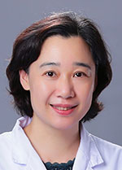

<!-- AUTO-GENERATED-BY: work/generate_obsidian_profiles.py -->

<!-- TEMPLATE: D:\workspace\信息收集整理\医生画像仓库\模板\医生画像模板.md -->

# 陈红梅

## 基础信息

| 字段 | 内容 |
|---|---|
| 姓名 | 陈红梅 |
| 医院 | 广东省人民医院 |
| 科室 | 内分泌科 |
| 职称/身份 | 主任医师 |
| 来源链接 | [官网原文](https://www.gdghospital.org.cn/Expertlistt/info_itemid_23256_subjectid_20.html) |
| 采集日期 | 2026-08-14 |

## 简介/擅长

于糖尿病及其并发症，代谢性疾病综合管理，甲状腺疾病以及各种内分泌危急重症，少见病和罕见疾病的诊治

## 教育与进修经历

- 医学硕士，研究生导师 广东省心血管病研究所心血管内科硕士研究生毕业；
- 曾赴澳大利亚悉尼大学RPA医院内分泌和糖尿病中心进修。

## 科研项目与成果

- 主持和参与国家级和省级科研基金项目12项。

## 可包装亮点

- 曾赴澳大利亚悉尼大学RPA医院内分泌和糖尿病中心进修。
- 目前任中华医学会内分泌学分会脂代谢学组委员；
- 广东省医学会内分泌分会委员；
- 广东省医学会糖尿病分会常委 ；

## 重点疾病/人群标签

- 慢性病：糖尿病、代谢、重症、罕见
- 肿瘤：
- 生殖疾病：
- 免疫/风湿：
- 术后恢复/康复：
- 疑难重症：糖尿病、代谢、重症、罕见

## 证据摘录

> 只摘录官网公开信息中的短句或关键字段，不复制大段原文。

- 官网身份字段：主任医师
- 官网简介/擅长：于糖尿病及其并发症，代谢性疾病综合管理，甲状腺疾病以及各种内分泌危急重症，少见病和罕见疾病的诊治
- 官网亮眼经历线索：曾赴澳大利亚悉尼大学RPA医院内分泌和糖尿病中心进修。 目前任中华医学会内分泌学分会脂代谢学组委员； 广东省医学会内分泌分会委员； 广东省医学会糖尿病分会常委 ；
- 来源链接：https://www.gdghospital.org.cn/Expertlistt/info_itemid_23256_subjectid_20.html

## BD 画像摘要

陈红梅医生可作为慢性病、疑难重症方向的基础画像候选。后续 BD 使用应继续以官网来源和人工复核为准，不添加疗效承诺或无来源包装。

## 合规边界

- 仅使用医院官网、官方公众号、官方小程序等公开渠道。
- 不采集私人电话、私人微信、家庭住址、患者隐私或非公开排班信息。
- 不写“保证治愈”“疗效第一”“包治疑难杂症”等无法由官网证明的表述。
