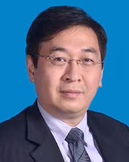

<!-- AUTO-GENERATED-BY: work/generate_obsidian_profiles.py -->

<!-- TEMPLATE: D:\workspace\信息收集整理\医生画像仓库\模板\医生画像模板.md -->

# 陈纪言

## 基础信息

| 字段 | 内容 |
|---|---|
| 姓名 | 陈纪言 |
| 医院 | 广东省人民医院 |
| 科室 | 心血管内科 |
| 职称/身份 | 主任医师 |
| 来源链接 | [官网原文](https://www.gdghospital.org.cn/Expertlistt/info_itemid_25490_subjectid_79.html) |
| 采集日期 | 2026-08-14 |

## 简介/擅长

治疗各种心血管疾病，尤其是在心脏瓣膜病介入与冠心病介入治疗方面有很高造诣

## 教育与进修经历

- 学术任职 ：中华医学会心血管病学分会介入心脏病专业学组成员、中国医师协会心血管内科医师分会委员、卫生部心血管疾病介入诊疗培训基地（冠心病介入）导师、海峡两岸医药卫生交流协会心血管专业委员会副主任委员、广东省介入性心脏病学会第三届委员会理事长、广东省医学会心血管学分会常委、广东省医师协会介入医师工作委员会副主任委员、任《国际心血管病杂志》委员会副主任委员，《中国介入心脏病学杂志》常务编委，《中华心血管病杂志》、《中国循环杂志》、《美国心脏病学杂志（JACC）中文版》、《欧洲心脏杂志（EHJ）》、《介入放射学杂志》…

## 科研项目与成果

- 重点攻关项目包括慢性闭塞病变、针对严重钙化病变以及弥漫的长病变的冠状动脉内旋磨技术、针对高危患者的左主干合并严重三支血管病变、弥漫性小血管病变以及合并严重心功能不全或并发心源性休克患者的介入治疗技术。

## 可包装亮点

- 医学博士、博士生导师、国务院特殊津贴专家、首席专家 擅长治疗各种心血管疾病，尤其是在心脏瓣膜病介入与冠心病介入治疗方面有很高造诣。
- 多次在美国心脏介入大会、欧洲心脏介入大会、亚太心脏介入大会等国际学术会议进行手术演示和大会发言。
- 2004年成为国务院政府特殊津贴专家。
- 2007年获九三学社广东省委员会建功立业奖。

## 重点疾病/人群标签

- 慢性病：冠心病、慢性、复杂、高危
- 肿瘤：
- 生殖疾病：
- 免疫/风湿：
- 术后恢复/康复：
- 疑难重症：冠心病、慢性、复杂、高危

## 证据摘录

> 只摘录官网公开信息中的短句或关键字段，不复制大段原文。

- 官网身份字段：主任医师
- 官网简介/擅长：治疗各种心血管疾病，尤其是在心脏瓣膜病介入与冠心病介入治疗方面有很高造诣
- 官网亮眼经历线索：医学博士、博士生导师、国务院特殊津贴专家、首席专家 擅长治疗各种心血管疾病，尤其是在心脏瓣膜病介入与冠心病介入治疗方面有很高造诣。 多次在美国心脏介入大会、欧洲心脏介入大会、亚太心脏介入大会等国际学术会议进行手术演示和大会发言。 2004年成为国务院政府特殊津贴专家。 2007年获九三学社广东省委员会建功立业奖。
- 来源链接：https://www.gdghospital.org.cn/Expertlistt/info_itemid_25490_subjectid_79.html

## BD 画像摘要

陈纪言医生可作为慢性病、疑难重症方向的基础画像候选。后续 BD 使用应继续以官网来源和人工复核为准，不添加疗效承诺或无来源包装。

## 合规边界

- 仅使用医院官网、官方公众号、官方小程序等公开渠道。
- 不采集私人电话、私人微信、家庭住址、患者隐私或非公开排班信息。
- 不写“保证治愈”“疗效第一”“包治疑难杂症”等无法由官网证明的表述。
