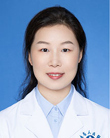

<!-- AUTO-GENERATED-BY: work/generate_obsidian_profiles.py -->

<!-- TEMPLATE: D:\workspace\信息收集整理\医生画像仓库\模板\医生画像模板.md -->

# 陈艳蕾

## 基础信息

| 字段 | 内容 |
|---|---|
| 姓名 | 陈艳蕾 |
| 医院 | 广东省人民医院 |
| 科室 | 眼科 |
| 职称/身份 | 主治医师 |
| 来源链接 | [官网原文](https://www.gdghospital.org.cn/Expertlistt/info_itemid_24985_subjectid_46.html) |
| 采集日期 | 2026-08-14 |

## 简介/擅长

白内障手术及屈光疾病的诊断及治疗，致力于白内障超声乳化吸除联合人工晶状体植入术的个体化治疗:针对患者眼部情况，个体化制定手术方案，针对性选择人工晶状体

## 科研项目与成果

- 从事眼科临床及科研工作多年，掌握眼科常见病、多发病的诊断及治疗。
- 参与省市级、国家级课题多项，多次在国家级眼科会议上进行学术汇报，发表学术论文数篇。

## 论文与学术产出

- 参与省市级、国家级课题多项，多次在国家级眼科会议上进行学术汇报，发表学术论文数篇。

## 可包装亮点

- 参与省市级、国家级课题多项，多次在国家级眼科会议上进行学术汇报，发表学术论文数篇。

## 重点疾病/人群标签

- 慢性病：
- 肿瘤：
- 生殖疾病：
- 免疫/风湿：
- 术后恢复/康复：
- 疑难重症：

## 证据摘录

> 只摘录官网公开信息中的短句或关键字段，不复制大段原文。

- 官网身份字段：主治医师
- 官网简介/擅长：白内障手术及屈光疾病的诊断及治疗，致力于白内障超声乳化吸除联合人工晶状体植入术的个体化治疗:针对患者眼部情况，个体化制定手术方案，针对性选择人工晶状体
- 官网亮眼经历线索：参与省市级、国家级课题多项，多次在国家级眼科会议上进行学术汇报，发表学术论文数篇。
- 来源链接：https://www.gdghospital.org.cn/Expertlistt/info_itemid_24985_subjectid_46.html

## BD 画像摘要

陈艳蕾医生可作为广东省人民医院眼科的基础医生资料入库。当前重点方向以总底表标签为准，官网未展示的信息保持空白。

## 合规边界

- 仅使用医院官网、官方公众号、官方小程序等公开渠道。
- 不采集私人电话、私人微信、家庭住址、患者隐私或非公开排班信息。
- 不写“保证治愈”“疗效第一”“包治疑难杂症”等无法由官网证明的表述。
