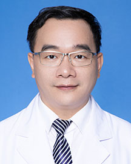

<!-- AUTO-GENERATED-BY: work/generate_obsidian_profiles.py -->

<!-- TEMPLATE: D:\workspace\信息收集整理\医生画像仓库\模板\医生画像模板.md -->

# 陈越峰

## 基础信息

| 字段 | 内容 |
|---|---|
| 姓名 | 陈越峰 |
| 医院 | 广东省人民医院 |
| 科室 | 超声科 |
| 职称/身份 | 副主任医师 |
| 来源链接 | [官网原文](https://www.gdghospital.org.cn/Expertlistt/info_itemid_25260_subjectid_62.html) |
| 采集日期 | 2026-08-14 |

## 简介/擅长

乳腺、甲状腺的超声诊断及经直肠超声，浅表软组织肿块超声诊断 从事超声诊断专业二十年余年，掌握常见病，多发病及疑难疾病的超声诊断

## 教育与进修经历

- 毕业于中山医科大学医疗系 专长：乳腺、甲状腺的超声诊断及经直肠超声，浅表软组织肿块超声诊断 从事超声诊断专业二十年余年，掌握常见病，多发病及疑难疾病的超声诊断。

## 科研项目与成果

- 在核心期刊上发表论文十余篇，主持并完成多项广东省卫生科研基金。

## 论文与学术产出

- 在核心期刊上发表论文十余篇，主持并完成多项广东省卫生科研基金。

## 可包装亮点

- 毕业于中山医科大学医疗系 专长：乳腺、甲状腺的超声诊断及经直肠超声，浅表软组织肿块超声诊断 从事超声诊断专业二十年余年，掌握常见病，多发病及疑难疾病的超声诊断。
- 在核心期刊上发表论文十余篇，主持并完成多项广东省卫生科研基金。

## 重点疾病/人群标签

- 慢性病：
- 肿瘤：
- 生殖疾病：
- 免疫/风湿：
- 术后恢复/康复：
- 疑难重症：疑难

## 证据摘录

> 只摘录官网公开信息中的短句或关键字段，不复制大段原文。

- 官网身份字段：副主任医师
- 官网简介/擅长：乳腺、甲状腺的超声诊断及经直肠超声，浅表软组织肿块超声诊断 从事超声诊断专业二十年余年，掌握常见病，多发病及疑难疾病的超声诊断
- 官网亮眼经历线索：毕业于中山医科大学医疗系 专长：乳腺、甲状腺的超声诊断及经直肠超声，浅表软组织肿块超声诊断 从事超声诊断专业二十年余年，掌握常见病，多发病及疑难疾病的超声诊断。 在核心期刊上发表论文十余篇，主持并完成多项广东省卫生科研基金。
- 来源链接：https://www.gdghospital.org.cn/Expertlistt/info_itemid_25260_subjectid_62.html

## BD 画像摘要

陈越峰医生可作为疑难重症方向的基础画像候选。后续 BD 使用应继续以官网来源和人工复核为准，不添加疗效承诺或无来源包装。

## 合规边界

- 仅使用医院官网、官方公众号、官方小程序等公开渠道。
- 不采集私人电话、私人微信、家庭住址、患者隐私或非公开排班信息。
- 不写“保证治愈”“疗效第一”“包治疑难杂症”等无法由官网证明的表述。
