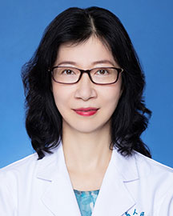

<!-- AUTO-GENERATED-BY: work/generate_obsidian_profiles.py -->

<!-- TEMPLATE: D:\workspace\信息收集整理\医生画像仓库\模板\医生画像模板.md -->

# 韩凤珍

## 基础信息

| 字段 | 内容 |
|---|---|
| 姓名 | 韩凤珍 |
| 医院 | 广东省人民医院 |
| 科室 | 产科 |
| 职称/身份 | 主任医师 |
| 来源链接 | [官网原文](https://www.gdghospital.org.cn/Expertlistt/info_itemid_24843_subjectid_52.html) |
| 采集日期 | 2026-08-14 |

## 简介/擅长

从事妇产科近三十年，擅长诊治妊娠合并症及并发症，高危妊娠的管理和监护

## 教育与进修经历

- 硕士研究生，毕业于中国医学科学院中国协和医科大学北京协和医院妇产科；
- 曾在香港大学玛丽医院产科工作及学习，在美国费城儿童医院做访问学者。

## 科研项目与成果

- 主持及参与多项省级及国家级课题，研究项目《先天性心脏病三级防治体系建立与关键技术创新及应用》获2018年“广东省科学技术”一等奖；

## 论文与学术产出

- 发表论文多篇。

## 可包装亮点

- 曾在香港大学玛丽医院产科工作及学习，在美国费城儿童医院做访问学者。
- 主持及参与多项省级及国家级课题，研究项目《先天性心脏病三级防治体系建立与关键技术创新及应用》获2018年“广东省科学技术”一等奖；
- 《先天性心脏病外科关键技术创新与综合防治体系的建立及应用》获2019年第十一届“宋庆龄儿科医学奖”；
- 发表论文多篇。

## 重点疾病/人群标签

- 慢性病：
- 肿瘤：
- 生殖疾病：
- 免疫/风湿：
- 术后恢复/康复：
- 疑难重症：危重、复杂、高危

## 证据摘录

> 只摘录官网公开信息中的短句或关键字段，不复制大段原文。

- 官网身份字段：主任医师
- 官网简介/擅长：从事妇产科近三十年，擅长诊治妊娠合并症及并发症，高危妊娠的管理和监护
- 官网亮眼经历线索：曾在香港大学玛丽医院产科工作及学习，在美国费城儿童医院做访问学者。 主持及参与多项省级及国家级课题，研究项目《先天性心脏病三级防治体系建立与关键技术创新及应用》获2018年“广东省科学技术”一等奖； 《先天性心脏病外科关键技术创新与综合防治体系的建立及应用》获2019年第十一届“宋庆龄儿科医学奖”； 发表论文多篇。
- 来源链接：https://www.gdghospital.org.cn/Expertlistt/info_itemid_24843_subjectid_52.html

## BD 画像摘要

韩凤珍医生可作为疑难重症方向的基础画像候选。后续 BD 使用应继续以官网来源和人工复核为准，不添加疗效承诺或无来源包装。

## 合规边界

- 仅使用医院官网、官方公众号、官方小程序等公开渠道。
- 不采集私人电话、私人微信、家庭住址、患者隐私或非公开排班信息。
- 不写“保证治愈”“疗效第一”“包治疑难杂症”等无法由官网证明的表述。
