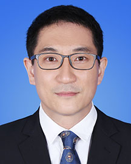

<!-- AUTO-GENERATED-BY: work/generate_obsidian_profiles.py -->

<!-- TEMPLATE: D:\workspace\信息收集整理\医生画像仓库\模板\医生画像模板.md -->

# 韩明

## 基础信息

| 字段 | 内容 |
|---|---|
| 姓名 | 韩明 |
| 医院 | 广东省人民医院 |
| 科室 | 器官移植科 |
| 职称/身份 | 副主任医师 |
| 来源链接 | [官网原文](https://www.gdghospital.org.cn/Expertlistt/info_itemid_47674_subjectid_12.html) |
| 采集日期 | 2026-08-14 |

## 简介/擅长

## 教育与进修经历

- 医学博士、硕士生导师 社会兼职和任职： 广东省器官医学与技术学分会常务委员 广东省基层医药学会器官捐献与移植专业委员会委员 广东省基层医药学会肿瘤多学科专业委员会委员 广东省精准医学应用学会癌症早筛早诊分会委员 教育经历和专业特长： 2010年硕博连读毕业于中山大学，获得外科学博士学位。
- 毕业后成为国内最早一批从事公民身后器官捐献的工作者，在器官功能评估与维护方面积累了丰富的经验。

## 可包装亮点

- 医学博士、硕士生导师 社会兼职和任职： 广东省器官医学与技术学分会常务委员 广东省基层医药学会器官捐献与移植专业委员会委员 广东省基层医药学会肿瘤多学科专业委员会委员 广东省精准医学应用学会癌症早筛早诊分会委员 教育经历和专业特长： 2010年硕博连读毕业于中山大学，获得外科学博士学位。
- 对肝移植围手术期管理、术后并发症防治及危重症患者的处理有着丰富的临床经验。
- 2023年8月以高层次人才引进广东省人民医院从事肝胆外科及肝移植工作 学术专业领域成就： 2016年作为主要技术骨干获得广东省科技进步一等奖，参与编写国内第一部器官捐献科普读物《公民身后器官捐献500问》及国内第一部器官捐献英文专著《Organ Donation and Transplantation after Cardiac Death in Chin…

## 重点疾病/人群标签

- 慢性病：
- 肿瘤：肿瘤、癌、术后、危重、多学科
- 生殖疾病：
- 免疫/风湿：
- 术后恢复/康复：肿瘤、癌、术后、危重、多学科
- 疑难重症：肿瘤、癌、术后、危重、多学科

## 证据摘录

> 只摘录官网公开信息中的短句或关键字段，不复制大段原文。

- 官网身份字段：副主任医师
- 官网亮眼经历线索：医学博士、硕士生导师 社会兼职和任职： 广东省器官医学与技术学分会常务委员 广东省基层医药学会器官捐献与移植专业委员会委员 广东省基层医药学会肿瘤多学科专业委员会委员 广东省精准医学应用学会癌症早筛早诊分会委员 教育经历和专业特长： 2010年硕博连读毕业于中山大学，获得外科学博士学位。 对肝移植围手术期管理、术后并发症防治及危重症患者的处理有着丰富的临床经验。 2023年8月以高层次人才引进广东省人民医院从事肝胆外科及肝移植工作 学…
- 来源链接：https://www.gdghospital.org.cn/Expertlistt/info_itemid_47674_subjectid_12.html

## BD 画像摘要

韩明医生可作为肿瘤、术后恢复/康复、疑难重症方向的基础画像候选。后续 BD 使用应继续以官网来源和人工复核为准，不添加疗效承诺或无来源包装。

## 合规边界

- 仅使用医院官网、官方公众号、官方小程序等公开渠道。
- 不采集私人电话、私人微信、家庭住址、患者隐私或非公开排班信息。
- 不写“保证治愈”“疗效第一”“包治疑难杂症”等无法由官网证明的表述。
