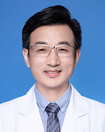

<!-- AUTO-GENERATED-BY: work/generate_obsidian_profiles.py -->

<!-- TEMPLATE: D:\workspace\信息收集整理\医生画像仓库\模板\医生画像模板.md -->

# 韩永智

## 基础信息

| 字段 | 内容 |
|---|---|
| 姓名 | 韩永智 |
| 医院 | 广东省人民医院 |
| 科室 | 皮肤性病科 |
| 职称/身份 | 主任医师 |
| 来源链接 | [官网原文](https://www.gdghospital.org.cn/Expertlistt/info_itemid_23903_subjectid_22.html) |
| 采集日期 | 2026-08-14 |

## 简介/擅长

## 科研项目与成果

- 主持并参与医学研究项目6项，发表论文40余篇，参编、参译皮肤病专著3部。

## 论文与学术产出

- 主持并参与医学研究项目6项，发表论文40余篇，参编、参译皮肤病专著3部。

## 可包装亮点

- 参加临床工作二十余年，主要从事过敏性皮肤病（特应性皮炎、湿疹、荨麻疹、药疹等）、痤疮、银屑病与皮肤肿瘤与病理的临床和研究工作，对疑难皮肤病和激光美容、疤痕、面部年轻化具有丰富的临床经验。
- 主持并参与医学研究项目6项，发表论文40余篇，参编、参译皮肤病专著3部。
- 社会兼职 广东省转化医学会皮肤病学分会主任委员 广东省医学会变态反应学会委员 广东省医学会皮肤科分会过敏与免疫学组委员 广东省医师协会皮肤科分会皮肤病理学组委员

## 重点疾病/人群标签

- 慢性病：
- 肿瘤：肿瘤、免疫、疑难
- 生殖疾病：
- 免疫/风湿：肿瘤、免疫、疑难
- 术后恢复/康复：
- 疑难重症：肿瘤、免疫、疑难

## 证据摘录

> 只摘录官网公开信息中的短句或关键字段，不复制大段原文。

- 官网身份字段：主任医师
- 官网亮眼经历线索：参加临床工作二十余年，主要从事过敏性皮肤病（特应性皮炎、湿疹、荨麻疹、药疹等）、痤疮、银屑病与皮肤肿瘤与病理的临床和研究工作，对疑难皮肤病和激光美容、疤痕、面部年轻化具有丰富的临床经验。 主持并参与医学研究项目6项，发表论文40余篇，参编、参译皮肤病专著3部。 社会兼职 广东省转化医学会皮肤病学分会主任委员 广东省医学会变态反应学会委员 广东省医学会皮肤科分会过敏与免疫学组委员 广东省医师协会皮肤科分会皮肤病理学组委员
- 来源链接：https://www.gdghospital.org.cn/Expertlistt/info_itemid_23903_subjectid_22.html

## BD 画像摘要

韩永智医生可作为肿瘤、免疫/风湿/感染、疑难重症方向的基础画像候选。后续 BD 使用应继续以官网来源和人工复核为准，不添加疗效承诺或无来源包装。

## 合规边界

- 仅使用医院官网、官方公众号、官方小程序等公开渠道。
- 不采集私人电话、私人微信、家庭住址、患者隐私或非公开排班信息。
- 不写“保证治愈”“疗效第一”“包治疑难杂症”等无法由官网证明的表述。
