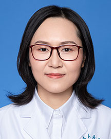

<!-- AUTO-GENERATED-BY: work/generate_obsidian_profiles.py -->

<!-- TEMPLATE: D:\workspace\信息收集整理\医生画像仓库\模板\医生画像模板.md -->

# 颜黎栩

## 基础信息

| 字段 | 内容 |
|---|---|
| 姓名 | 颜黎栩 |
| 医院 | 广东省人民医院 |
| 科室 | 病理科 |
| 职称/身份 | 副主任医师 |
| 来源链接 | [官网原文](https://www.gdghospital.org.cn/Expertlistt/info_itemid_25310_subjectid_59.html) |
| 采集日期 | 2026-08-14 |

## 简介/擅长

胸部肿瘤病理诊断及分子病理诊断

## 教育与进修经历

- 博士 美国纪念斯隆凯特琳癌症中心（MSKCC）访问学者 国际肺癌研究协会（IASLC）会员 全国医用临床检验实验室和体外诊断系统标准化技术委员会（SAC/TC136）委员 全国卫生产业企业管理协会实验医学专业委员会病理专家委员会委员 中国研究型医院学会分子诊断医学专委会青年委员 中国抗癌协会肿瘤病理学专业委员会肺癌病理学组委员 中国抗癌协会肿瘤分子医学专业委员会委员 中国抗癌协会肿瘤标志专业委员会委员 中国女医师协会病理学专业委员会委员 广东省医学会病理学分会青年委员 广东省医学会病理学分会数字与分子学组委员 广…

## 科研项目与成果

- 博士 美国纪念斯隆凯特琳癌症中心（MSKCC）访问学者 国际肺癌研究协会（IASLC）会员 全国医用临床检验实验室和体外诊断系统标准化技术委员会（SAC/TC136）委员 全国卫生产业企业管理协会实验医学专业委员会病理专家委员会委员 中国研究型医院学会分子诊断医学专委会青年委员 中国抗癌协会肿瘤病理学专业委员会肺癌病理学组委员 中国抗癌协会肿瘤分子医学专业委员会委员 中国抗癌协会肿瘤标志专业委员会委员 中国女医师协会病理学专业委员会委员 广东省医学会病理学分会青年委员 广东省医学会病理学分会数字与分子学组委员 广…

## 可包装亮点

- 博士 美国纪念斯隆凯特琳癌症中心（MSKCC）访问学者 国际肺癌研究协会（IASLC）会员 全国医用临床检验实验室和体外诊断系统标准化技术委员会（SAC/TC136）委员 全国卫生产业企业管理协会实验医学专业委员会病理专家委员会委员 中国研究型医院学会分子诊断医学专委会青年委员 中国抗癌协会肿瘤病理学专业委员会肺癌病理学组委员 中国抗癌协会肿瘤分子医学专业…

## 重点疾病/人群标签

- 慢性病：
- 肿瘤：肿瘤、癌、肺癌、免疫
- 生殖疾病：
- 免疫/风湿：肿瘤、癌、肺癌、免疫
- 术后恢复/康复：
- 疑难重症：

## 证据摘录

> 只摘录官网公开信息中的短句或关键字段，不复制大段原文。

- 官网身份字段：副主任医师
- 官网简介/擅长：胸部肿瘤病理诊断及分子病理诊断
- 官网亮眼经历线索：博士 美国纪念斯隆凯特琳癌症中心（MSKCC）访问学者 国际肺癌研究协会（IASLC）会员 全国医用临床检验实验室和体外诊断系统标准化技术委员会（SAC/TC136）委员 全国卫生产业企业管理协会实验医学专业委员会病理专家委员会委员 中国研究型医院学会分子诊断医学专委会青年委员 中国抗癌协会肿瘤病理学专业委员会肺癌病理学组委员 中国抗癌协会肿瘤分子医学专业委员会委员 中国抗癌协会肿瘤标志专业委员会委员 中国女医师协会病理学专业委员会委…
- 来源链接：https://www.gdghospital.org.cn/Expertlistt/info_itemid_25310_subjectid_59.html

## BD 画像摘要

颜黎栩医生可作为肿瘤、免疫/风湿/感染方向的基础画像候选。后续 BD 使用应继续以官网来源和人工复核为准，不添加疗效承诺或无来源包装。

## 合规边界

- 仅使用医院官网、官方公众号、官方小程序等公开渠道。
- 不采集私人电话、私人微信、家庭住址、患者隐私或非公开排班信息。
- 不写“保证治愈”“疗效第一”“包治疑难杂症”等无法由官网证明的表述。
