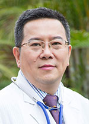

<!-- AUTO-GENERATED-BY: work/generate_obsidian_profiles.py -->

<!-- TEMPLATE: D:\workspace\信息收集整理\医生画像仓库\模板\医生画像模板.md -->

# 马冬

## 基础信息

| 字段 | 内容 |
|---|---|
| 姓名 | 马冬 |
| 医院 | 广东省人民医院 |
| 科室 | 肿瘤内科 |
| 职称/身份 | 主任医师 |
| 来源链接 | [官网原文](https://www.gdghospital.org.cn/Expertlistt/info_itemid_25083_subjectid_33.html) |
| 采集日期 | 2026-08-14 |

## 简介/擅长

消化系统肿瘤和老年常见恶性肿瘤的多学科综合治疗

## 教育与进修经历

- 专业特长 ：1988年毕业于广州中山医科大学。

## 科研项目与成果

- 科研成果 ：承担多项国内和国际性的多中心临床研究项目，主持和承担多项省级科研课题，主编和参加编写《胰腺癌临床实践-争论与共识》、《消化系肿瘤循证化疗治疗学》、《肿瘤中西医治疗学》和《实用消化系肿瘤学》等多部专著。

## 论文与学术产出

- 科研成果 ：承担多项国内和国际性的多中心临床研究项目，主持和承担多项省级科研课题，主编和参加编写《胰腺癌临床实践-争论与共识》、《消化系肿瘤循证化疗治疗学》、《肿瘤中西医治疗学》和《实用消化系肿瘤学》等多部专著。

## 可包装亮点

- 从事肿瘤科工作三十余年，对各种实体肿瘤的诊治有丰富的临床经验，尤其擅长消化系统肿瘤和老年常见恶性肿瘤的多学科综合治疗。
- 学术兼职 ：现兼任中国临床肿瘤学会CSCO胃肠胰神经内分泌肿瘤专家委员会、CSCO胰腺癌专家委员会委员；
- 广州抗癌协会副理事长、肝胆胰肿瘤专业委员会主任委员、大肠癌专业委员会主任委员；
- 广东省抗癌协会癌症康复与姑息治疗专业委员会副主委、化疗专业委员会副主委、大肠癌专业委员会、胃癌专业委员会和靶向与个体化治疗专业委员会常务委员、胰腺癌专业委员会委员；

## 重点疾病/人群标签

- 慢性病：
- 肿瘤：肿瘤、癌、化疗、靶向、胃癌、肠癌、康复、姑息、多学科、MDT
- 生殖疾病：
- 免疫/风湿：
- 术后恢复/康复：肿瘤、癌、化疗、靶向、胃癌、肠癌、康复、姑息、多学科、MDT
- 疑难重症：肿瘤、癌、化疗、靶向、胃癌、肠癌、康复、姑息、多学科、MDT

## 证据摘录

> 只摘录官网公开信息中的短句或关键字段，不复制大段原文。

- 官网身份字段：主任医师
- 官网简介/擅长：消化系统肿瘤和老年常见恶性肿瘤的多学科综合治疗
- 官网亮眼经历线索：从事肿瘤科工作三十余年，对各种实体肿瘤的诊治有丰富的临床经验，尤其擅长消化系统肿瘤和老年常见恶性肿瘤的多学科综合治疗。 学术兼职 ：现兼任中国临床肿瘤学会CSCO胃肠胰神经内分泌肿瘤专家委员会、CSCO胰腺癌专家委员会委员； 广州抗癌协会副理事长、肝胆胰肿瘤专业委员会主任委员、大肠癌专业委员会主任委员； 广东省抗癌协会癌症康复与姑息治疗专业委员会副主委、化疗专业委员会副主委、大肠癌专业委员会、胃癌专业委员会和靶向与个体化治疗专业委员会…
- 来源链接：https://www.gdghospital.org.cn/Expertlistt/info_itemid_25083_subjectid_33.html

## BD 画像摘要

马冬医生可作为肿瘤、术后恢复/康复、疑难重症方向的基础画像候选。后续 BD 使用应继续以官网来源和人工复核为准，不添加疗效承诺或无来源包装。

## 合规边界

- 仅使用医院官网、官方公众号、官方小程序等公开渠道。
- 不采集私人电话、私人微信、家庭住址、患者隐私或非公开排班信息。
- 不写“保证治愈”“疗效第一”“包治疑难杂症”等无法由官网证明的表述。
