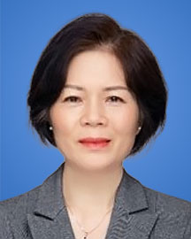

<!-- AUTO-GENERATED-BY: work/generate_obsidian_profiles.py -->

<!-- TEMPLATE: D:\workspace\信息收集整理\医生画像仓库\模板\医生画像模板.md -->

# 骆新兰

## 基础信息

| 字段 | 内容 |
|---|---|
| 姓名 | 骆新兰 |
| 医院 | 广东省人民医院 |
| 科室 | 病理科 |
| 职称/身份 | 主任技师 |
| 来源链接 | [官网原文](https://www.gdghospital.org.cn/Expertlistt/info_itemid_25295_subjectid_59.html) |
| 采集日期 | 2026-08-14 |

## 简介/擅长

## 科研项目与成果

- 广东省人民医院病理科技术室负责人 主任技师 中国抗癌协会肿瘤病理专业委员会病理技术协作组 副组长 中国研究型医院学会病理专业委员会技术学组 副组长 广东省医学会病理学分会 常委 广东省医学会病理学分会技术学组 副组长 广东省抗癌协会肿瘤病理专业委员会 常委 广东省基层医药学会病理专业委员会 副主任委员 广东省粤港澳促进会医药卫生大健康委员会病理联盟 常委 《中华病理学杂志》 审稿专家 《临床与实验病理学杂志》 编委 正式发表论文130多篇（第一作者或参与作者），主持或参与科研课题10多项

## 论文与学术产出

- 广东省人民医院病理科技术室负责人 主任技师 中国抗癌协会肿瘤病理专业委员会病理技术协作组 副组长 中国研究型医院学会病理专业委员会技术学组 副组长 广东省医学会病理学分会 常委 广东省医学会病理学分会技术学组 副组长 广东省抗癌协会肿瘤病理专业委员会 常委 广东省基层医药学会病理专业委员会 副主任委员 广东省粤港澳促进会医药卫生大健康委员会病理联盟 常委 《中华病理学杂志》 审稿专家 《临床与实验病理学杂志》 编委 正式发表论文130多篇（第一作者或参与作者），主持或参与科研课题10多项

## 可包装亮点

- 广东省人民医院病理科技术室负责人 主任技师 中国抗癌协会肿瘤病理专业委员会病理技术协作组 副组长 中国研究型医院学会病理专业委员会技术学组 副组长 广东省医学会病理学分会 常委 广东省医学会病理学分会技术学组 副组长 广东省抗癌协会肿瘤病理专业委员会 常委 广东省基层医药学会病理专业委员会 副主任委员 广东省粤港澳促进会医药卫生大健康委员会病理联盟 常委…

## 重点疾病/人群标签

- 慢性病：
- 肿瘤：
- 生殖疾病：
- 免疫/风湿：
- 术后恢复/康复：
- 疑难重症：

## 证据摘录

> 只摘录官网公开信息中的短句或关键字段，不复制大段原文。

- 官网身份字段：主任技师
- 官网亮眼经历线索：广东省人民医院病理科技术室负责人 主任技师 中国抗癌协会肿瘤病理专业委员会病理技术协作组 副组长 中国研究型医院学会病理专业委员会技术学组 副组长 广东省医学会病理学分会 常委 广东省医学会病理学分会技术学组 副组长 广东省抗癌协会肿瘤病理专业委员会 常委 广东省基层医药学会病理专业委员会 副主任委员 广东省粤港澳促进会医药卫生大健康委员会病理联盟 常委 《中华病理学杂志》 审稿专家 《临床与实验病理学杂志》 编委 正式发表论文130…
- 异常提示：职称/身份需人工复核
- 来源链接：https://www.gdghospital.org.cn/Expertlistt/info_itemid_25295_subjectid_59.html

## BD 画像摘要

骆新兰医生可作为广东省人民医院病理科的基础医生资料入库。当前重点方向以总底表标签为准，官网未展示的信息保持空白。

## 合规边界

- 仅使用医院官网、官方公众号、官方小程序等公开渠道。
- 不采集私人电话、私人微信、家庭住址、患者隐私或非公开排班信息。
- 不写“保证治愈”“疗效第一”“包治疑难杂症”等无法由官网证明的表述。
