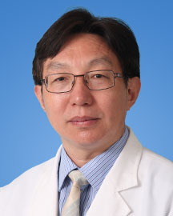

<!-- AUTO-GENERATED-BY: work/generate_obsidian_profiles.py -->

<!-- TEMPLATE: D:\workspace\信息收集整理\医生画像仓库\模板\医生画像模板.md -->

# 高兴林

## 基础信息

| 字段 | 内容 |
|---|---|
| 姓名 | 高兴林 |
| 医院 | 广东省人民医院 |
| 科室 | 呼吸与危重症医学科、老年呼吸一科 |
| 职称/身份 | 主任医师 |
| 来源链接 | [官网原文](https://www.gdghospital.org.cn/Expertlistt/info_itemid_33972_subjectid_19.html) |
| 采集日期 | 2026-08-14 |

## 简介/擅长

慢性咳嗽、哮喘、感染、肿瘤的诊治

## 教育与进修经历

- 曾2次留学德国。

## 论文与学术产出

- 以第一及通讯作者发表SCI及核心期刊论文60多篇，《中华老年医学杂志》副总编辑，《中华结核和呼吸杂志》通信编委。

## 可包装亮点

- 教授，德国医学博士，博士生导师 呼吸科与危重症医学科原主任，现广东省老年医学研究所副所长，老年呼吸一科主任，中华医学会呼吸病学分会委员，广东省医师协会呼吸科医师分会主任委员，对呼吸科疑难少见病的诊治有丰富的经验, 擅长慢性咳嗽、哮喘、感染、肿瘤的诊治。
- 曾2次留学德国。
- 以第一及通讯作者发表SCI及核心期刊论文60多篇，《中华老年医学杂志》副总编辑，《中华结核和呼吸杂志》通信编委。

## 重点疾病/人群标签

- 慢性病：慢性、肿瘤、感染、疑难、危重
- 肿瘤：慢性、肿瘤、感染、疑难、危重
- 生殖疾病：
- 免疫/风湿：慢性、肿瘤、感染、疑难、危重
- 术后恢复/康复：
- 疑难重症：慢性、肿瘤、感染、疑难、危重

## 证据摘录

> 只摘录官网公开信息中的短句或关键字段，不复制大段原文。

- 官网身份字段：主任医师
- 官网简介/擅长：慢性咳嗽、哮喘、感染、肿瘤的诊治
- 官网亮眼经历线索：教授，德国医学博士，博士生导师 呼吸科与危重症医学科原主任，现广东省老年医学研究所副所长，老年呼吸一科主任，中华医学会呼吸病学分会委员，广东省医师协会呼吸科医师分会主任委员，对呼吸科疑难少见病的诊治有丰富的经验, 擅长慢性咳嗽、哮喘、感染、肿瘤的诊治。 曾2次留学德国。 以第一及通讯作者发表SCI及核心期刊论文60多篇，《中华老年医学杂志》副总编辑，《中华结核和呼吸杂志》通信编委。
- 来源链接：https://www.gdghospital.org.cn/Expertlistt/info_itemid_33972_subjectid_19.html

## BD 画像摘要

高兴林医生可作为慢性病、肿瘤、免疫/风湿/感染、疑难重症方向的基础画像候选。后续 BD 使用应继续以官网来源和人工复核为准，不添加疗效承诺或无来源包装。

## 合规边界

- 仅使用医院官网、官方公众号、官方小程序等公开渠道。
- 不采集私人电话、私人微信、家庭住址、患者隐私或非公开排班信息。
- 不写“保证治愈”“疗效第一”“包治疑难杂症”等无法由官网证明的表述。
