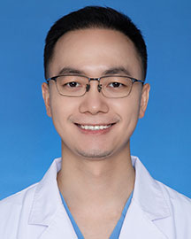

<!-- AUTO-GENERATED-BY: work/generate_obsidian_profiles.py -->

<!-- TEMPLATE: D:\workspace\信息收集整理\医生画像仓库\模板\医生画像模板.md -->

# 高强

## 基础信息

| 字段 | 内容 |
|---|---|
| 姓名 | 高强 |
| 医院 | 广东省人民医院 |
| 科室 | 心外科 |
| 职称/身份 | 主治医师 |
| 来源链接 | [官网原文](https://www.gdghospital.org.cn/Expertlistt/info_itemid_33826_subjectid_80.html) |
| 采集日期 | 2026-08-14 |

## 简介/擅长

## 教育与进修经历

- 临床医学博士，硕士研究生导师，哈佛大学医学院/布莱根妇女医院、加州大学洛杉矶分校访问学者，广东省结构性心脏病诊疗安全委员会委员，广东省中西医结合学会微创外科专业委员会委员。

## 科研项目与成果

- 在科研方面具有较丰富的经验，累计以第一或通讯作者发表SCI文章/国内核心期刊20余篇，主持省级、市级、厅级项目各1项，参于国家级和省级重点项目多项。

## 论文与学术产出

- 在科研方面具有较丰富的经验，累计以第一或通讯作者发表SCI文章/国内核心期刊20余篇，主持省级、市级、厅级项目各1项，参于国家级和省级重点项目多项。

## 可包装亮点

- 临床医学博士，硕士研究生导师，哈佛大学医学院/布莱根妇女医院、加州大学洛杉矶分校访问学者，广东省结构性心脏病诊疗安全委员会委员，广东省中西医结合学会微创外科专业委员会委员。
- 中华医学会胸心血管外科分会青年委员会第四届心外青年医师手术技能大赛中获得广东赛区特等奖，南部赛区一等奖，全国总决赛二等奖。
- 在科研方面具有较丰富的经验，累计以第一或通讯作者发表SCI文章/国内核心期刊20余篇，主持省级、市级、厅级项目各1项，参于国家级和省级重点项目多项。

## 重点疾病/人群标签

- 慢性病：
- 肿瘤：
- 生殖疾病：
- 免疫/风湿：
- 术后恢复/康复：
- 疑难重症：

## 证据摘录

> 只摘录官网公开信息中的短句或关键字段，不复制大段原文。

- 官网身份字段：主治医师
- 官网亮眼经历线索：临床医学博士，硕士研究生导师，哈佛大学医学院/布莱根妇女医院、加州大学洛杉矶分校访问学者，广东省结构性心脏病诊疗安全委员会委员，广东省中西医结合学会微创外科专业委员会委员。 中华医学会胸心血管外科分会青年委员会第四届心外青年医师手术技能大赛中获得广东赛区特等奖，南部赛区一等奖，全国总决赛二等奖。 在科研方面具有较丰富的经验，累计以第一或通讯作者发表SCI文章/国内核心期刊20余篇，主持省级、市级、厅级项目各1项，参于国家级和省级重点项…
- 来源链接：https://www.gdghospital.org.cn/Expertlistt/info_itemid_33826_subjectid_80.html

## BD 画像摘要

高强医生可作为广东省人民医院心外科的基础医生资料入库。当前重点方向以总底表标签为准，官网未展示的信息保持空白。

## 合规边界

- 仅使用医院官网、官方公众号、官方小程序等公开渠道。
- 不采集私人电话、私人微信、家庭住址、患者隐私或非公开排班信息。
- 不写“保证治愈”“疗效第一”“包治疑难杂症”等无法由官网证明的表述。
