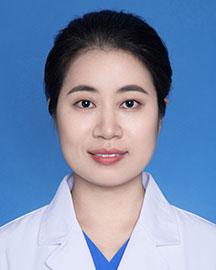

<!-- AUTO-GENERATED-BY: work/generate_obsidian_profiles.py -->

<!-- TEMPLATE: D:\workspace\信息收集整理\医生画像仓库\模板\医生画像模板.md -->

# 高红飞

## 基础信息

| 字段 | 内容 |
|---|---|
| 姓名 | 高红飞 |
| 医院 | 广东省人民医院 |
| 科室 | 乳腺肿瘤科 |
| 职称/身份 | 主治医师 |
| 来源链接 | [官网原文](https://www.gdghospital.org.cn/Expertlistt/info_itemid_25055_subjectid_30.html) |
| 采集日期 | 2026-08-14 |

## 简介/擅长

师从吴一龙教授，专注于乳腺癌多学科个体化综合治疗，对乳腺癌手术，化疗，靶 向治疗，内分泌治疗，免疫治疗等有丰富的临床经验

## 科研项目与成果

- 科研能力：参与多项国际、国内多中心临床研究。
- 主持国家自然科学基金，广东省医学科研基金，广州市基础研究计划基础与应 用基础研究项目，广东省中医药局科研项目，吴阶平医学基金，中国抗癌协会靶点 基金各1项。

## 论文与学术产出

- 研究方向：乳腺癌的基础和临床研究，参编肿瘤学著作2本。
- 以第一作者发表SCI文章10余 篇。

## 可包装亮点

- 专长 师从吴一龙教授，专注于乳腺癌多学科个体化综合治疗，对乳腺癌手术，化疗，靶 向治疗，内分泌治疗，免疫治疗等有丰富的临床经验。
- 中国抗癌协会临床肿瘤学协 作专业委员会（CSCO）会员。
- 美国临床肿瘤协会（ASCO）会员。
- 以第一作者发表SCI文章10余 篇。

## 重点疾病/人群标签

- 慢性病：
- 肿瘤：肿瘤、癌、化疗、乳腺癌、免疫、康复、多学科、MDT
- 生殖疾病：
- 免疫/风湿：肿瘤、癌、化疗、乳腺癌、免疫、康复、多学科、MDT
- 术后恢复/康复：肿瘤、癌、化疗、乳腺癌、免疫、康复、多学科、MDT
- 疑难重症：肿瘤、癌、化疗、乳腺癌、免疫、康复、多学科、MDT

## 证据摘录

> 只摘录官网公开信息中的短句或关键字段，不复制大段原文。

- 官网身份字段：主治医师
- 官网简介/擅长：师从吴一龙教授，专注于乳腺癌多学科个体化综合治疗，对乳腺癌手术，化疗，靶 向治疗，内分泌治疗，免疫治疗等有丰富的临床经验
- 官网亮眼经历线索：专长 师从吴一龙教授，专注于乳腺癌多学科个体化综合治疗，对乳腺癌手术，化疗，靶 向治疗，内分泌治疗，免疫治疗等有丰富的临床经验。 中国抗癌协会临床肿瘤学协 作专业委员会（CSCO）会员。 美国临床肿瘤协会（ASCO）会员。 以第一作者发表SCI文章10余 篇。
- 来源链接：https://www.gdghospital.org.cn/Expertlistt/info_itemid_25055_subjectid_30.html

## BD 画像摘要

高红飞医生可作为肿瘤、免疫/风湿/感染、术后恢复/康复、疑难重症方向的基础画像候选。后续 BD 使用应继续以官网来源和人工复核为准，不添加疗效承诺或无来源包装。

## 合规边界

- 仅使用医院官网、官方公众号、官方小程序等公开渠道。
- 不采集私人电话、私人微信、家庭住址、患者隐私或非公开排班信息。
- 不写“保证治愈”“疗效第一”“包治疑难杂症”等无法由官网证明的表述。
