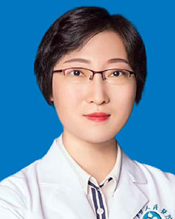

<!-- AUTO-GENERATED-BY: work/generate_obsidian_profiles.py -->

<!-- TEMPLATE: D:\workspace\信息收集整理\医生画像仓库\模板\医生画像模板.md -->

# 魏薇

## 基础信息

| 字段 | 内容 |
|---|---|
| 姓名 | 魏薇 |
| 医院 | 广东省人民医院 |
| 科室 | 心血管内科 |
| 职称/身份 | 副主任医师 |
| 来源链接 | [官网原文](https://www.gdghospital.org.cn/Expertlistt/info_itemid_25548_subjectid_79.html) |
| 采集日期 | 2026-08-14 |

## 简介/擅长

各种心血管疾病的诊疗，特别擅长各种心律失常的药物和介入诊疗，包括导管消融术和起搏治疗

## 教育与进修经历

- 医学博士、硕士生导师 第五届“羊城好医生”，美国芝加哥大学访问学者。

## 科研项目与成果

- 主持国家自然科学基金、广东省自然科学基金、广州市科技计划等科研项目，参与多项国际多中心和国家级科研项目，发表多篇SCI 收录学术论文。

## 论文与学术产出

- 主持国家自然科学基金、广东省自然科学基金、广州市科技计划等科研项目，参与多项国际多中心和国家级科研项目，发表多篇SCI 收录学术论文。

## 可包装亮点

- 医学博士、硕士生导师 第五届“羊城好医生”，美国芝加哥大学访问学者。
- 主持国家自然科学基金、广东省自然科学基金、广州市科技计划等科研项目，参与多项国际多中心和国家级科研项目，发表多篇SCI 收录学术论文。
- 现任中华医学会心电和起搏分会中青年电生理工作委员会委员，广东省医学会心脏起搏与电生理学分会青年副主委。

## 重点疾病/人群标签

- 慢性病：
- 肿瘤：
- 生殖疾病：
- 免疫/风湿：
- 术后恢复/康复：
- 疑难重症：

## 证据摘录

> 只摘录官网公开信息中的短句或关键字段，不复制大段原文。

- 官网身份字段：副主任医师
- 官网简介/擅长：各种心血管疾病的诊疗，特别擅长各种心律失常的药物和介入诊疗，包括导管消融术和起搏治疗
- 官网亮眼经历线索：医学博士、硕士生导师 第五届“羊城好医生”，美国芝加哥大学访问学者。 主持国家自然科学基金、广东省自然科学基金、广州市科技计划等科研项目，参与多项国际多中心和国家级科研项目，发表多篇SCI 收录学术论文。 现任中华医学会心电和起搏分会中青年电生理工作委员会委员，广东省医学会心脏起搏与电生理学分会青年副主委。
- 来源链接：https://www.gdghospital.org.cn/Expertlistt/info_itemid_25548_subjectid_79.html

## BD 画像摘要

魏薇医生可作为广东省人民医院心血管内科的基础医生资料入库。当前重点方向以总底表标签为准，官网未展示的信息保持空白。

## 合规边界

- 仅使用医院官网、官方公众号、官方小程序等公开渠道。
- 不采集私人电话、私人微信、家庭住址、患者隐私或非公开排班信息。
- 不写“保证治愈”“疗效第一”“包治疑难杂症”等无法由官网证明的表述。
