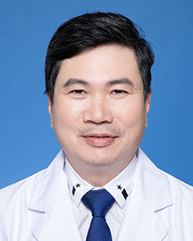

<!-- AUTO-GENERATED-BY: work/generate_obsidian_profiles.py -->

<!-- TEMPLATE: D:\workspace\信息收集整理\医生画像仓库\模板\医生画像模板.md -->

# 麦明杰

## 基础信息

| 字段 | 内容 |
|---|---|
| 姓名 | 麦明杰 |
| 医院 | 广东省人民医院 |
| 科室 | 心外科 |
| 职称/身份 | 主任医师 |
| 来源链接 | [官网原文](https://www.gdghospital.org.cn/Expertlistt/info_itemid_24337_subjectid_80.html) |
| 采集日期 | 2026-08-14 |

## 简介/擅长

冠状动脉搭桥、心脏瓣膜替换及成形、心脏移植、心肺联合移植、心室辅助、心脏肿瘤等外科治疗

## 科研项目与成果

- 主要参与的攻关项目《非体外循环微创冠状动脉旁路移植等新技术的临床应用研究》获广东省科学技术进步奖二等奖，主持省自然基金项目《雷帕霉素促进调节性T细胞产生的分子机制的实验研究》、参与科技部（国际合作项目《一种全新的器官保存方法（心脏干燥保存）研究》。

## 可包装亮点

- 曾赴北京及美国著名医疗机构访问学习。
- 现任广东省胸部疾病心肺移植学会副主任委员。
- 主要参与的攻关项目《非体外循环微创冠状动脉旁路移植等新技术的临床应用研究》获广东省科学技术进步奖二等奖，主持省自然基金项目《雷帕霉素促进调节性T细胞产生的分子机制的实验研究》、参与科技部（国际合作项目《一种全新的器官保存方法（心脏干燥保存）研究》。
- 现任广东省胸部疾病学会心肺移植专业委员会副主任委员、广东省中西医结合学会心血管病专业委员会常务委员。

## 重点疾病/人群标签

- 慢性病：
- 肿瘤：肿瘤、瘤
- 生殖疾病：
- 免疫/风湿：
- 术后恢复/康复：
- 疑难重症：

## 证据摘录

> 只摘录官网公开信息中的短句或关键字段，不复制大段原文。

- 官网身份字段：主任医师
- 官网简介/擅长：冠状动脉搭桥、心脏瓣膜替换及成形、心脏移植、心肺联合移植、心室辅助、心脏肿瘤等外科治疗
- 官网亮眼经历线索：曾赴北京及美国著名医疗机构访问学习。 现任广东省胸部疾病心肺移植学会副主任委员。 主要参与的攻关项目《非体外循环微创冠状动脉旁路移植等新技术的临床应用研究》获广东省科学技术进步奖二等奖，主持省自然基金项目《雷帕霉素促进调节性T细胞产生的分子机制的实验研究》、参与科技部（国际合作项目《一种全新的器官保存方法（心脏干燥保存）研究》。 现任广东省胸部疾病学会心肺移植专业委员会副主任委员、广东省中西医结合学会心血管病专业委员会常务委员。
- 来源链接：https://www.gdghospital.org.cn/Expertlistt/info_itemid_24337_subjectid_80.html

## BD 画像摘要

麦明杰医生可作为肿瘤方向的基础画像候选。后续 BD 使用应继续以官网来源和人工复核为准，不添加疗效承诺或无来源包装。

## 合规边界

- 仅使用医院官网、官方公众号、官方小程序等公开渠道。
- 不采集私人电话、私人微信、家庭住址、患者隐私或非公开排班信息。
- 不写“保证治愈”“疗效第一”“包治疑难杂症”等无法由官网证明的表述。
