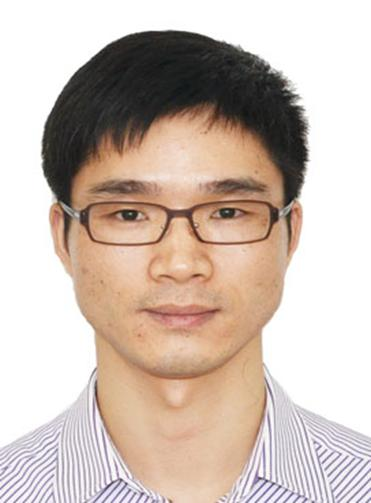

<!-- AUTO-GENERATED-BY: work/generate_obsidian_profiles.py -->

<!-- TEMPLATE: D:\workspace\信息收集整理\医生画像仓库\模板\医生画像模板.md -->

# 黄伟平

## 基础信息

| 字段 | 内容 |
|---|---|
| 姓名 | 黄伟平 |
| 医院 | 广东省人民医院 |
| 科室 | 重症医学科 |
| 职称/身份 | 副主任医师 |
| 来源链接 | [官网原文](https://www.gdghospital.org.cn/Expertlistt/info_itemid_25445_subjectid_100.html) |
| 采集日期 | 2026-08-14 |

## 简介/擅长

## 教育与进修经历

- 学会任职 ： 中华医学会急诊医学分会创伤学组委员 广州市医学会重症医学分会委员 华南理工大学医学院兼职教师 广州市120急救技能培训师资 研究方向和成果 ： 毕业于中山医科大学临床医学专业，从事急危重症医学十余年，曾在美国VCU的Weil重症医学研究所访问留学。

## 科研项目与成果

- 学会任职 ： 中华医学会急诊医学分会创伤学组委员 广州市医学会重症医学分会委员 华南理工大学医学院兼职教师 广州市120急救技能培训师资 研究方向和成果 ： 毕业于中山医科大学临床医学专业，从事急危重症医学十余年，曾在美国VCU的Weil重症医学研究所访问留学。
- 研究方向为脓毒症、脓毒性休克及脓毒症相关性脑病发病机制的研究，主持完成了广东省自然科学基金、广东省卫生厅科研项目各1项。

## 论文与学术产出

- 发表SCI论文 1篇，国内医学核心期刊学术论文十余篇。

## 可包装亮点

- 学会任职 ： 中华医学会急诊医学分会创伤学组委员 广州市医学会重症医学分会委员 华南理工大学医学院兼职教师 广州市120急救技能培训师资 研究方向和成果 ： 毕业于中山医科大学临床医学专业，从事急危重症医学十余年，曾在美国VCU的Weil重症医学研究所访问留学。
- 发表SCI论文 1篇，国内医学核心期刊学术论文十余篇。

## 重点疾病/人群标签

- 慢性病：
- 肿瘤：
- 生殖疾病：
- 免疫/风湿：
- 术后恢复/康复：
- 疑难重症：重症、急危重

## 证据摘录

> 只摘录官网公开信息中的短句或关键字段，不复制大段原文。

- 官网身份字段：副主任医师
- 官网亮眼经历线索：学会任职 ： 中华医学会急诊医学分会创伤学组委员 广州市医学会重症医学分会委员 华南理工大学医学院兼职教师 广州市120急救技能培训师资 研究方向和成果 ： 毕业于中山医科大学临床医学专业，从事急危重症医学十余年，曾在美国VCU的Weil重症医学研究所访问留学。 发表SCI论文 1篇，国内医学核心期刊学术论文十余篇。
- 来源链接：https://www.gdghospital.org.cn/Expertlistt/info_itemid_25445_subjectid_100.html

## BD 画像摘要

黄伟平医生可作为疑难重症方向的基础画像候选。后续 BD 使用应继续以官网来源和人工复核为准，不添加疗效承诺或无来源包装。

## 合规边界

- 仅使用医院官网、官方公众号、官方小程序等公开渠道。
- 不采集私人电话、私人微信、家庭住址、患者隐私或非公开排班信息。
- 不写“保证治愈”“疗效第一”“包治疑难杂症”等无法由官网证明的表述。
