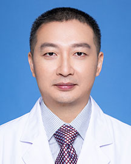

<!-- AUTO-GENERATED-BY: work/generate_obsidian_profiles.py -->

<!-- TEMPLATE: D:\workspace\信息收集整理\医生画像仓库\模板\医生画像模板.md -->

# 黄俊伟

## 基础信息

| 字段 | 内容 |
|---|---|
| 姓名 | 黄俊伟 |
| 医院 | 广东省人民医院 |
| 科室 | 呼吸与危重症医学科 |
| 职称/身份 | 副主任医师 |
| 来源链接 | [官网原文](https://www.gdghospital.org.cn/Expertlistt/info_itemid_25387_subjectid_19.html) |
| 采集日期 | 2026-08-14 |

## 简介/擅长

治疗呼吸内科常见疾病，如肺部感染、慢性咳嗽、哮喘、慢性阻塞性肺病、气胸、胸腔积液、支气管扩张、肺癌、呼吸衰竭等的诊治，熟练掌握支气管镜检查及气道内介入治疗，同时在病房开展无创呼吸机辅助通气治疗

## 可包装亮点

- 治疗呼吸内科常见疾病，如肺部感染、慢性咳嗽、哮喘、慢性阻塞性肺病、气胸、胸腔积液、支气管扩张、肺癌、呼吸衰竭等的诊治，熟练掌握支气管镜检查及气道内介入治疗，同时在病房开展无创呼吸机辅助通气治疗

## 重点疾病/人群标签

- 慢性病：慢性、肺癌、感染、危重
- 肿瘤：慢性、肺癌、感染、危重
- 生殖疾病：
- 免疫/风湿：慢性、肺癌、感染、危重
- 术后恢复/康复：
- 疑难重症：慢性、肺癌、感染、危重

## 证据摘录

> 只摘录官网公开信息中的短句或关键字段，不复制大段原文。

- 官网身份字段：副主任医师
- 官网简介/擅长：治疗呼吸内科常见疾病，如肺部感染、慢性咳嗽、哮喘、慢性阻塞性肺病、气胸、胸腔积液、支气管扩张、肺癌、呼吸衰竭等的诊治，熟练掌握支气管镜检查及气道内介入治疗，同时在病房开展无创呼吸机辅助通气治疗
- 来源链接：https://www.gdghospital.org.cn/Expertlistt/info_itemid_25387_subjectid_19.html

## BD 画像摘要

黄俊伟医生可作为慢性病、肿瘤、免疫/风湿/感染、疑难重症方向的基础画像候选。后续 BD 使用应继续以官网来源和人工复核为准，不添加疗效承诺或无来源包装。

## 合规边界

- 仅使用医院官网、官方公众号、官方小程序等公开渠道。
- 不采集私人电话、私人微信、家庭住址、患者隐私或非公开排班信息。
- 不写“保证治愈”“疗效第一”“包治疑难杂症”等无法由官网证明的表述。
