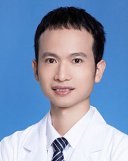

<!-- AUTO-GENERATED-BY: work/generate_obsidian_profiles.py -->

<!-- TEMPLATE: D:\workspace\信息收集整理\医生画像仓库\模板\医生画像模板.md -->

# 黄凯军

## 基础信息

| 字段 | 内容 |
|---|---|
| 姓名 | 黄凯军 |
| 医院 | 广东省人民医院 |
| 科室 | 肝胆外科 |
| 职称/身份 | 主治医师 |
| 来源链接 | [官网原文](https://www.gdghospital.org.cn/Expertlistt/info_itemid_32777_subjectid_105.html) |
| 采集日期 | 2026-08-14 |

## 简介/擅长

致力于肝病的诊疗，包括乙肝、肝良、恶性肿瘤、肝胆管结石、胆囊息肉、胆囊结石

## 教育与进修经历

- 简介 2008 - 2016，中山大学 中山医学院 临床医学八年制（本硕博连读），博士毕业，师从“国之名医”、广东省肝胆外科主任委员彭宝岗教授 2016-至今 于广东省人民医院肝胆外科工作 主治医生 担任广州市医师协会肝胆胰外科医师分会委员 广东省老年保健协会肝癌MDT专业委员会委员 广东省基层医药学会胆道外科专业委员会委员 长期致力于从事肝癌的综合治疗研究，研究肝癌的发生、发展的机制，进一步探索肝癌治疗的新思路。

## 科研项目与成果

- 目前主持并参与多项省部级科研项目：国自然基金项目、广东省医学科研项目、广州市科技项目等，以第一作者身份发表或参与SCI论文10余篇。

## 论文与学术产出

- 目前主持并参与多项省部级科研项目：国自然基金项目、广东省医学科研项目、广州市科技项目等，以第一作者身份发表或参与SCI论文10余篇。

## 可包装亮点

- 简介 2008 - 2016，中山大学 中山医学院 临床医学八年制（本硕博连读），博士毕业，师从“国之名医”、广东省肝胆外科主任委员彭宝岗教授 2016-至今 于广东省人民医院肝胆外科工作 主治医生 担任广州市医师协会肝胆胰外科医师分会委员 广东省老年保健协会肝癌MDT专业委员会委员 广东省基层医药学会胆道外科专业委员会委员 长期致力于从事肝癌的综合治疗研…
- 目前主持并参与多项省部级科研项目：国自然基金项目、广东省医学科研项目、广州市科技项目等，以第一作者身份发表或参与SCI论文10余篇。

## 重点疾病/人群标签

- 慢性病：
- 肿瘤：肿瘤、肝癌、MDT
- 生殖疾病：
- 免疫/风湿：
- 术后恢复/康复：
- 疑难重症：肿瘤、肝癌、MDT

## 证据摘录

> 只摘录官网公开信息中的短句或关键字段，不复制大段原文。

- 官网身份字段：主治医师
- 官网简介/擅长：致力于肝病的诊疗，包括乙肝、肝良、恶性肿瘤、肝胆管结石、胆囊息肉、胆囊结石
- 官网亮眼经历线索：简介 2008 - 2016，中山大学 中山医学院 临床医学八年制（本硕博连读），博士毕业，师从“国之名医”、广东省肝胆外科主任委员彭宝岗教授 2016-至今 于广东省人民医院肝胆外科工作 主治医生 担任广州市医师协会肝胆胰外科医师分会委员 广东省老年保健协会肝癌MDT专业委员会委员 广东省基层医药学会胆道外科专业委员会委员 长期致力于从事肝癌的综合治疗研究，研究肝癌的发生、发展的机制，进一步探索肝癌治疗的新思路。 目前主持并参与多项…
- 来源链接：https://www.gdghospital.org.cn/Expertlistt/info_itemid_32777_subjectid_105.html

## BD 画像摘要

黄凯军医生可作为肿瘤、疑难重症方向的基础画像候选。后续 BD 使用应继续以官网来源和人工复核为准，不添加疗效承诺或无来源包装。

## 合规边界

- 仅使用医院官网、官方公众号、官方小程序等公开渠道。
- 不采集私人电话、私人微信、家庭住址、患者隐私或非公开排班信息。
- 不写“保证治愈”“疗效第一”“包治疑难杂症”等无法由官网证明的表述。
