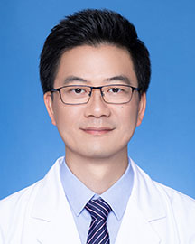

<!-- AUTO-GENERATED-BY: work/generate_obsidian_profiles.py -->

<!-- TEMPLATE: D:\workspace\信息收集整理\医生画像仓库\模板\医生画像模板.md -->

# 黄国华

## 基础信息

| 字段 | 内容 |
|---|---|
| 姓名 | 黄国华 |
| 医院 | 广东省人民医院 |
| 科室 | 呼吸与危重症医学科 |
| 职称/身份 | 主治医师 |
| 来源链接 | [官网原文](https://www.gdghospital.org.cn/Expertlistt/info_itemid_25374_subjectid_19.html) |
| 采集日期 | 2026-08-14 |

## 简介/擅长

于气道疾病急危重症的救治，精通支气管镜的介入治疗（活检、球囊扩张、扩张、消融及支架）、胸腔镜诊治不明原因胸腔积液及气胸、肺功能的评估和康复、以及呼吸机等的临床应用

## 科研项目与成果

- 作为主要研究者参与多项国家级、省厅级科研课题，参编有《内科胸腔镜》《介入性肺病学》《肺康复学》专著。

## 论文与学术产出

- 作为主要研究者参与多项国家级、省厅级科研课题，参编有《内科胸腔镜》《介入性肺病学》《肺康复学》专著。

## 可包装亮点

- 广东省医学会呼吸分会肺功能学组委员 广东省胸部疾病学会康复委员会委员 研究方向为慢性气道炎症及重症医学，对呼吸道常见及疑难疾病如不明原因慢性咳嗽的病因诊断、慢性阻塞性肺疾病（慢性支气管炎、肺气肿）的治疗及康复、支气管哮喘的诊断及处理、肺癌的综合治疗、肺部感染、胸腔积液以及急慢性呼吸衰竭等呼吸疾病的诊治都积累了丰富的经验，精于思辨，注重个体化治疗方案，擅长于…

## 重点疾病/人群标签

- 慢性病：慢性、肺癌、感染、康复、疑难、危重、重症、急危重
- 肿瘤：慢性、肺癌、感染、康复、疑难、危重、重症、急危重
- 生殖疾病：
- 免疫/风湿：慢性、肺癌、感染、康复、疑难、危重、重症、急危重
- 术后恢复/康复：慢性、肺癌、感染、康复、疑难、危重、重症、急危重
- 疑难重症：慢性、肺癌、感染、康复、疑难、危重、重症、急危重

## 证据摘录

> 只摘录官网公开信息中的短句或关键字段，不复制大段原文。

- 官网身份字段：主治医师
- 官网简介/擅长：于气道疾病急危重症的救治，精通支气管镜的介入治疗（活检、球囊扩张、扩张、消融及支架）、胸腔镜诊治不明原因胸腔积液及气胸、肺功能的评估和康复、以及呼吸机等的临床应用
- 官网亮眼经历线索：广东省医学会呼吸分会肺功能学组委员 广东省胸部疾病学会康复委员会委员 研究方向为慢性气道炎症及重症医学，对呼吸道常见及疑难疾病如不明原因慢性咳嗽的病因诊断、慢性阻塞性肺疾病（慢性支气管炎、肺气肿）的治疗及康复、支气管哮喘的诊断及处理、肺癌的综合治疗、肺部感染、胸腔积液以及急慢性呼吸衰竭等呼吸疾病的诊治都积累了丰富的经验，精于思辨，注重个体化治疗方案，擅长于气道疾病急危重症的救治，精通支气管镜的介入治疗（活检、球囊扩张、扩张、消融及支架…
- 来源链接：https://www.gdghospital.org.cn/Expertlistt/info_itemid_25374_subjectid_19.html

## BD 画像摘要

黄国华医生可作为慢性病、肿瘤、免疫/风湿/感染、术后恢复/康复、疑难重症方向的基础画像候选。后续 BD 使用应继续以官网来源和人工复核为准，不添加疗效承诺或无来源包装。

## 合规边界

- 仅使用医院官网、官方公众号、官方小程序等公开渠道。
- 不采集私人电话、私人微信、家庭住址、患者隐私或非公开排班信息。
- 不写“保证治愈”“疗效第一”“包治疑难杂症”等无法由官网证明的表述。
