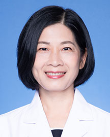

<!-- AUTO-GENERATED-BY: work/generate_obsidian_profiles.py -->

<!-- TEMPLATE: D:\workspace\信息收集整理\医生画像仓库\模板\医生画像模板.md -->

# 黄妙琼

## 基础信息

| 字段 | 内容 |
|---|---|
| 姓名 | 黄妙琼 |
| 医院 | 广东省人民医院 |
| 科室 | 口腔科门诊 |
| 职称/身份 | 主任医师 |
| 来源链接 | [官网原文](https://www.gdghospital.org.cn/Expertlistt/info_itemid_24965_subjectid_47.html) |
| 采集日期 | 2026-08-14 |

## 简介/擅长

口腔正畸工作，对于青少年牙颌畸形、成年人牙颌畸形、牙周病正畸治疗有深入研究

## 教育与进修经历

- 毕业于中山医科大学口腔系，从事口腔工作二十多年。

## 科研项目与成果

- 广东省口腔正畸专业委员会委员，广东省科研立项课题责任人。
- 探讨并开展了目前国际上备受关注的早期颌骨畸形的生长改良治疗，担任该项目的省医学科研立项课题责任人。
- 发表科研论文十多篇。

## 论文与学术产出

- 发表科研论文十多篇。

## 可包装亮点

- 广东省口腔正畸专业委员会委员，广东省科研立项课题责任人。
- 现获口腔科主任医师资格。
- 发表科研论文十多篇。

## 重点疾病/人群标签

- 慢性病：
- 肿瘤：
- 生殖疾病：
- 免疫/风湿：
- 术后恢复/康复：
- 疑难重症：

## 证据摘录

> 只摘录官网公开信息中的短句或关键字段，不复制大段原文。

- 官网身份字段：主任医师
- 官网简介/擅长：口腔正畸工作，对于青少年牙颌畸形、成年人牙颌畸形、牙周病正畸治疗有深入研究
- 官网亮眼经历线索：广东省口腔正畸专业委员会委员，广东省科研立项课题责任人。 现获口腔科主任医师资格。 发表科研论文十多篇。
- 来源链接：https://www.gdghospital.org.cn/Expertlistt/info_itemid_24965_subjectid_47.html

## BD 画像摘要

黄妙琼医生可作为广东省人民医院口腔科门诊的基础医生资料入库。当前重点方向以总底表标签为准，官网未展示的信息保持空白。

## 合规边界

- 仅使用医院官网、官方公众号、官方小程序等公开渠道。
- 不采集私人电话、私人微信、家庭住址、患者隐私或非公开排班信息。
- 不写“保证治愈”“疗效第一”“包治疑难杂症”等无法由官网证明的表述。
